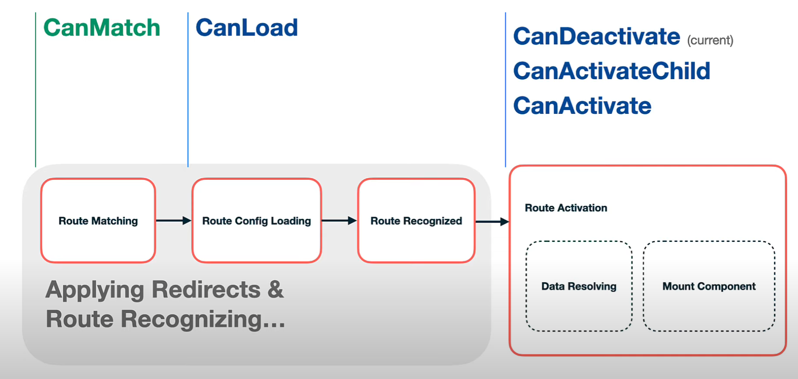

<h1 align="center">Angular Routing</h1>


<span style="background-color: coral;font-weight:bold;color:#2d2d2d; padding: 5px; border-radius: 3px; display:inline-block; margin: 5px 0 0 5px;">#SCAMS</span>
<span style="background-color: coral;font-weight:bold;color:#2d2d2d; padding: 5px; border-radius: 3px; display:inline-block; margin: 5px 0 0 5px;">#standaloneComponents</span>
<span style="background-color: coral;font-weight:bold;color:#2d2d2d; padding: 5px; border-radius: 3px; display:inline-block; margin: 5px 0 0 5px;">#lazyComponentLoading</span>
<span style="background-color: coral;font-weight:bold;color:#2d2d2d; padding: 5px; border-radius: 3px; display:inline-block; margin: 5px 0 0 5px;">#routing</span>
<span style="background-color: coral;font-weight:bold;color:#2d2d2d; padding: 5px; border-radius: 3px; display:inline-block; margin: 5px 0 0 5px;">#rezolvers</span>
<span style="background-color: coral;font-weight:bold;color:#2d2d2d; padding: 5px; border-radius: 3px; display:inline-block; margin: 5px 0 0 5px;">#asyncGuards</span>

# Introduction

Angular's router is a powerful and flexible module that provides sophisticated routing capabilities for Single Page Applications (SPAs). While many developers are familiar with basic routing concepts, there are some more advanced features and techniques you can leverage in Angular's router.

# Lazy loading

Lazy loading is a design pattern in software development where you defer the loading of a module or a piece of functionality until it is actually needed. In the context of Angular, lazy loading is primarily associated with modules, and it's a technique used to optimize the initial loading time of your application.

When you lazy load a module in an Angular application, you only load that module's code when the user navigates to a route that requires a component, service, or another artifact of that module. This contrasts with the traditional (eager) approach of loading all modules and their associated code, when the application starts, which can lead to longer initial load times, especially in large applications.

This can be achieved in Angular by providing the module via the `loadChildern` property:

```typescript
const routes: Routes = [
  // Regular routes
  { path: "home", component: HomeComponent },
  { path: "about", component: AboutComponent },

  // Lazy-loaded module
  {
    path: "lazy",
    loadChildren: () => import("./lazy/lazy.module").then((m) => m.LazyModule),
  },
];
```

**Benefits of lazy loading in Angular include:**

- Faster Initial Load Time (TTI): Lazy loading reduces the initial bundle size, resulting in faster application startup times. Users only download the code they need for the part of the application they are currently interacting with.

- Better Resource Utilization: Resources are loaded on-demand, which means that users don't waste bandwidth and loading time on parts of the application they might never visit.

- Improved Developer Experience: Lazy loading allows developers to organize their code into smaller, more manageable modules, making the application structure cleaner and more maintainable.

- Enhanced Caching: Smaller bundles are more cache-friendly. Once a user has loaded a lazy-loaded module, subsequent visits to other parts of the application that use the same module can be faster due to cached resources.

Besides eager and on-demand module loading, Angular also allows developers to use module preloading. <br>

The main difference between on demand loading and module preloading is that in the case of preloading, the Angular router loads modules asynchronously in the background after the main application has been loaded. <br>

**Preloading strategy advantages:**

- Faster Subsequent Navigation: By pre-loading modules in the background, subsequent navigations to different parts of the application are faster because the required modules are already available in the browser's cache.

- Improved User Experience: users experience faster transitions between views and fewer delays when navigating through different sections of the application. This leads to a more responsive and seamless user experience.

- Granular Control Over Pre-loading: Angular provides flexibility in configuring which modules should be pre-loaded and which should be loaded on-demand. Developers can define specific pre-loading strategies based on the application's requirements, ensuring optimal performance.

- Fine-Grained Control Over Prioritization: Developers can prioritize the pre-loading of modules based on their importance to the user journey or business logic. This allows for fine-grained control over which parts of the application are optimized for pre-loading.

## SCAMs vs standalone components

Single Component Angular Modules (SCAMs) are an Angular concept that allows each component to have its own dedicated `ngModule`. This approach enables you to isolate the dependencies of each component, making the codebase easier to understand and manage.

SCAMs are typically used in conjunction with Angular's lazy loading features to optimize the performance of Angular applications. By wrapping each component in its own module, you can take advantage of Angular's lazy loading mechanism to only load the component's dependencies when the component is needed.

Angular v14 introduced a new feature: Standalone components. These components are not tied to any Angular module and can be imported and used anywhere in the application. Another big benefit of these components is that they can be lazy-loaded like modules. Therefore being a good replacement for SCAMS in some use cases.

Almost all the router guards and all preloading strategies are compatible with standalone components.

# Router guards

Router guards in Angular are a set of interfaces and services that allow you to execute logic before or after navigating to a route. They provide a way to control access to certain routes, confirm navigation, and resolve data before a route is activated. Router guards are crucial for implementing features like authentication, authorization, and data fetching in Angular applications.



There are several types of router guards, each serving a specific purpose:

- `canActivate` guard is used to determine whether a route can be activated. It's commonly used for authentication and authorization checks before allowing a user to navigate to a specific route.

  ```typescript
  import { Injectable } from "@angular/core";
  import {
    CanActivate,
    ActivatedRouteSnapshot,
    RouterStateSnapshot,
    UrlTree,
    Router,
  } from "@angular/router";
  import { Observable } from "rxjs";
  import { AuthService } from "./auth.service";

  @Injectable({
    providedIn: "root",
  })
  export class AuthGuard implements CanActivate {
    constructor(private authService: AuthService, private router: Router) {}

    canActivate(
      next: ActivatedRouteSnapshot,
      state: RouterStateSnapshot
    ):
      | Observable<boolean | UrlTree>
      | Promise<boolean | UrlTree>
      | boolean
      | UrlTree {
      if (this.authService.isAuthenticated()) {
        return true;
      } else {
        // Redirect to the login page if not authenticated
        return this.router.parseUrl("/login");
      }
    }
  }
  ```

- `canActivateChild` guard is similar to CanActivate, but it is used for child routes. It allows you to perform checks before activating child routes within a parent route.

- `canDeactivate` guard is used to determine whether a user can leave a route, providing a confirmation prompt or other logic before navigating away. The component implementing `canComponentDeactivate` needs to have a `canDeactivate` method.

  ```typescript
  import { Component } from "@angular/core";
  import { CanComponentDeactivate } from "./can-deactivate.interface";

  @Component({
    selector: "app-example",
    template: `
      <div>
        <h2>Example Component</h2>
        <p>Data: {{ data }}</p>
      </div>
    `,
  })
  export class ExampleComponent implements CanComponentDeactivate {
    data: string = "Example Data"; // Assume some data to be displayed

    canDeactivate(): boolean {
      // Logic to determine if the component can be deactivated
      return true;
    }
  }
  ```

  Route configuration:

  ```typescript
  const routes: Routes = [
    {
      path: "example",
      component: ExampleComponent,
      canDeactivate: [CanDeactivateGuard],
    },
  ];
  ```

- `resolve` guard is used to fetch data before activating a route. It ensures that the data is available before rendering the component associated with the route.

  ```typescript
  export class DataResolver implements Resolve<string> {
    constructor(private dataService: DataService) {}
    resolve(
      route: ActivatedRouteSnapshot,
      state: RouterStateSnapshot
    ): Observable<string> | Promise<string> | string {
      return this.dataService.getData();
    }
  }
  ```

  In the route configuration, you can use resolve to specify the resolver:

  ```typescript
  const routes: Routes = [
    {
      path: "data",
      component: DataComponent,
      resolve: { resolvedData: DataResolver },
    },
  ];
  ```

  In the component, you can access the resolved data using the ActivatedRoute:

  ```typescript
  import { ActivatedRoute } from '@angular/router';

  ngOnInit() {
    this.data = this.route.snapshot.data.resolvedData;
  }

  ```

- `canLoad` If you have a lazy-loaded module with a `canActivate` router guard, it doesn't prevent the loading of the module bundle, even if navigation is restricted due to the guard. The `canLoad` interface addresses this issue by entirely halting the loading of the lazy module bundle, based on the logic defined in the guard. A big drawback of the `canLoad` guard is that it only works with lazy loaded modules and **not** lazy-loaded standalone components. Also in the future, it might be deprecated in favor of the `canMatch` guard.

- `canMatch` guard is a feature introduced in Angular v14 that provides a flexible way to match routes based on certain conditions. Unlike the traditional `canActivate` and `canLoad` guards, `canMatch` allows you to define the same route multiple times with different guards, enabling you to navigate to a specific route based on the conditions defined in those guards. `canMatch` **works with both lazy-loaded modules and lazy-loaded standalone components**. If the guard returns false, the route is skipped and the router continues to match other potential routes. However, returning false does not cancel the navigation; the URL remains the same.

  ```typescript
  @Injectable({
    providedIn: "root",
  })
  export class IsLoggedIn implements CanMatch {
    constructor(private userService: UserService) {}

    canMatch(
      route: Route,
      segments: Array<UrlSegment>
    ):
      | boolean
      | UrlTree
      | Observable<boolean | UrlTree>
      | Promise<boolean | UrlTree> {
      return this.userService.isLoggedIn();
    }
  }
  ```

  In this example, the `IsLoggedIn` guard checks if the user is logged in and returns true or false accordingly. This guard can then be used in the routing configuration as follows:

  ```typescript
  [
    { path: "", component: LoggedInHomeComponent, canMatch: [IsLoggedIn] },
    { path: "", component: HomeComponent },
  ];
  ```

# Router preloading strategies

In Angular, route preloading strategies are used to improve the performance of lazy-loaded routes. They define the logic for preloading and processing lazy-loaded Angular modules. There are three main commonly used strategies:

- `NoPreloading` is the default loading strategy for lazy modules in Angular. With this strategy modules are lazy-loaded on-demand by the router on navigation events.
- `PreloadAllModules` strategy preloads all lazy-loaded modules. This strategy is useful for small applications with fewer modules. However, it can increase network usage and client-side computation, leading to a slower user experience for larger applications.
- `QuicklinkStrategy` strategy preloads only the routes associated with the links on the current page. It uses the `IntersectionObserver` API to achieve this, which can significantly reduce network usage and client-side computation. The `ngx-quicklink` package provides this strategy. This strategy is more suitable for larger applications with many modules.

For more advanced scenarios, you might consider using a predictive preloading library such as [Guess.js](https://guess-js.github.io/docs/angular). These types of libraries analyze user behavior data and preload only the JavaScript chunks that are likely to be needed next, making your preloading strategy even more network efficient.

Angular makes implementing these strategies quite easy. Here is an example of implementing the `QuicklinkStrategy` strategy:

```typescript
import { QuicklinkStrategy, QuicklinkModule } from "ngx-quicklink";
@NgModule({
  imports: [
    QuicklinkModule,
    RouterModule.forRoot(
      [
        /*.routes..*/
      ],
      {
        preloadingStrategy: QuicklinkStrategy,
      }
    ),
  ],
})
export class AppModule {}
```

## Custom router preloading strategies

Angular also allows us to create custom router preloading strategies by implementing the `preloadingStrategy` interface. In the following example, we'll implement a preloading strategy that loads a module only if the user is authenticated. Custom preloading strategies come in handy in this case because preloading modules do not work with the `canLoad` guard.

The first step in implementing a `preloadingStrategy` is to extend the interface:

```typescript
@Injectable({
  providedIn: "root",
})
export class AuthPreloadStrategy implements PreloadingStrategy {
  constructor(private auth: AuthService) {}

  preload(route: Route, fn: () => Observable<any>): Observable<any> {
    return this.auth
      .isLoggedIn()
      .pipe(switchMap((isUserLoggedIn) => (isUserLoggedIn ? fn() : of(null))));
  }
}
```

(auth-preload-strategy.ts)

Then we need to add it to the router module config property:

```typescript
const routes: Routes = [
  {
    path: "admin",
    loadChildren: () =>
      import("./admin/admin.module").then((m) => m.AdminModule),
  },
  {
    path: "",
    component: HomeComponent,
  },
];

@NgModule({
  imports: [
    RouterModule.forRoot(routes, {
      preloadingStrategy: AuthPreloadStrategy,
    }),
  ],
  exports: [RouterModule],
})
export class AppRoutingModule {}
```

# Route reuse strategies

Even though we've optimized our application for efficiency, a keen-eyed user might still observe a slight delay during navigation. This can result in a brief moment where data tables might appear empty or a loading spinner is displayed, even though the data is already cached.

This quick delay occurs when Angular recreates a component, notably, this tends to happen when transitioning between routes that utilize different component classes.To help us with this behaviour, the framework provides us with the route reuse strategy.

A route reuse strategy refers to the set of rules that the router uses to determine whether to reuse or recreate components when navigating between routes. The router reuse strategy is an integral part of how the router manages the state of the application during navigation.

The base route reuse strategy provided by Angular only reuses routes when the matched router configs are identical. This ensures that components are not destroyed and recreated solely due to changes in the fragment or query parameters of the URL.

Angular allows us to use a custom route loading strategy by implementing the `RouteReuseStrategy` interface. This interface defines methods such as `shouldReuseRoute`, `store`, and `retrieve`.

```typescript
import {
  RouteReuseStrategy,
  ActivatedRouteSnapshot,
  DetachedRouteHandle,
} from "@angular/router";

export class CustomReuseStrategy implements RouteReuseStrategy {
  shouldReuseRoute(
    future: ActivatedRouteSnapshot,
    curr: ActivatedRouteSnapshot
  ): boolean {
    return (
      future.routeConfig === curr.routeConfig || future.data.reuseComponent
    );
  }
}
```

```typescript
@NgModule({
  providers: [
    { provide: RouteReuseStrategy, useClass: CustomReuseStrategy },
  ],
})

const routes: Routes = [
  {
    path: 'app',
    component: SampleComponent,
    data: {
      reuseComponent: true
    }
  }
];
```

(Example of a costum route reuse strategy)

# Custom route matchers

In Angular custom route matchers provide a way to define your own routing rules,beyond the standard provided ones. This feature is useful when you need to match URLs based on complex patterns that cannot be expressed using the standard path and pathMatch properties in the route configuration.

```typescript
RouterModule.forRoot([
  {
    matcher: (url) => {
      if (url.length === 1 && url[0].path.match(/^@[\w]+$/gm)) {
        return {
          consumed: url,
          posParams: {
            username: new UrlSegment(url[0].path.substr(1), {}),
          },
        };
      }
      return null;
    },
    component: ProfileComponent,
  },
]);
```

(Example of a custom route matcher that matches URLs in the format '@username')

A custom route matcher is a function that takes an array of `UrlSegment` objects and returns a `UrlMatchResult` object or `null`. If the function returns a `UrlMatchResult` object, the router treats the URL as matched by the route. If it returns `null`, the router continues to look for other routes that might match the URL.

# Secondary outlets (named router outlets)

Named router outlets, often referred to as secondary outlets, enrich the Angular framework by offering a powerful mechanism to manage multiple views within a single component or layout. They facilitate the simultaneous display of various components, enabling the creation of intricate and dynamic layouts. Whether orchestrating master-detail views, implementing tabbed interfaces, or crafting nested layouts, named outlets enhance the developer's ability to design sophisticated user interfaces.
<br>
Practical applications extend to authentication flows, dynamic content loading, multi-step processes, and personalized user experiences. With their flexibility, named outlets empower developers to build applications with independent, updateable sections, elevating the overall user experience in Angular.

**Implementing a named router outlet**

The first step in implementing a secondary outlet is to define it in your main template like this:

```html
<!-- app.component.html -->

<div>
  <router-outlet></router-outlet>
  <!-- Primary Outlet -->
</div>

<div>
  <router-outlet name="secondary"></router-outlet>
  <!-- Secondary Outlet -->
</div>
```

The second step consists of configuring routes with named outlets:
In your route configuration, you can specify the outlet for each route using the outlet property:

```typescript
// app-routing.module.ts

const routes: Routes = [
  { path: "", component: HomeComponent }, // Default route for the primary outlet
  { path: "secondary", component: SecondaryComponent, outlet: "secondary" },
];

@NgModule({
  imports: [RouterModule.forRoot(routes)],
  exports: [RouterModule],
})
export class AppRoutingModule {}
```

Now we can navigate to the named outlet in your template using the routerLink directive or programmatically:

```html
<a routerLink="/">Home</a>
<a
  routerLink="/secondary"
  routerLinkActive="active"
  [routerLinkActiveOptions]="{ exact: true }"
  >Secondary</a
>
```

```typescript
constructor(private router: Router) {}
navigateToSecondaryOutlet() {
  this.router.navigate([{ outlets: { secondary: 'secondary' } }]);
}
```

# Child routes and nested routing

Child routes and nested routing in Angular provide a powerful mechanism for organizing and managing the navigation structure of an application.

## Child routes

Child routes are routes that are defined within the configuration of a parent route. They are associated with and nested under a particular parent route.

```typescript
const routes: Routes = [
  {
    path: "parent",
    component: ParentComponent,
    children: [
      { path: "child1", component: Child1Component },
      { path: "child2", component: Child2Component },
    ],
  },
];
```

It is also needed to include a <router-outlet> element in the parent component's template, to specify where the child components will be rendered.

## Nested routing

Nested routing refers to the practice of creating hierarchies of routes by incorporating child routes within other child routes. This allows for the creation of deeply nested navigation structures.

```typescript
const routes: Routes = [
  {
    path: "dashboard",
    component: DashboardComponent,
    children: [
      { path: "section1", component: Section1Component },
      {
        path: "section2",
        component: Section2Component,
        children: [
          { path: "subsection1", component: Subsection1Component },
          { path: "subsection2", component: Subsection2Component },
        ],
      },
    ],
  },
];
```

(Dashboard component with multiple sections, each with its own set of child routes.)

Each level of the nested route hierarchy corresponds to a <router-outlet> in the component template. The parent component's template includes a primary <router-outlet> for the main content and additional outlets for each nested level.

```html
<!-- DashboardComponent template -->
<div>
  <router-outlet></router-outlet>
  <!-- Primary outlet for main content -->
  <div>
    <router-outlet name="section2"></router-outlet>
    <!-- Outlet for Section2Component -->
  </div>
</div>
```

Navigation through nested routes involves specifying the full URL path, including all parent and child route segments. For example, to navigate to 'subsection1' in the 'dashboard/section2' route, the URL would be '/dashboard/section2/subsection1.

**Benefits of using child and nested routes**

- Organized Structure: Child routes and nested routing help in organizing the application's structure by encapsulating related components and views within the hierarchy.

- Code Modularity: This approach promotes code modularity, making it easier to manage and maintain as the application grows.

- Granular Navigation: Nested routing allows for granular navigation, enabling users to navigate to specific sections or components within a larger context.

- Flexible Layouts: Developers can create more flexible layouts by strategically placing <router-outlet> elements in the component templates.
