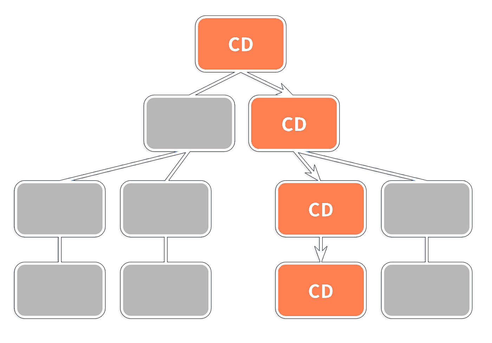
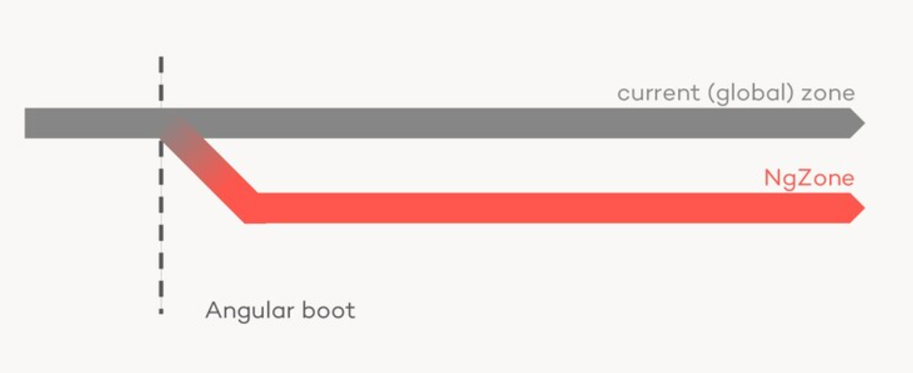
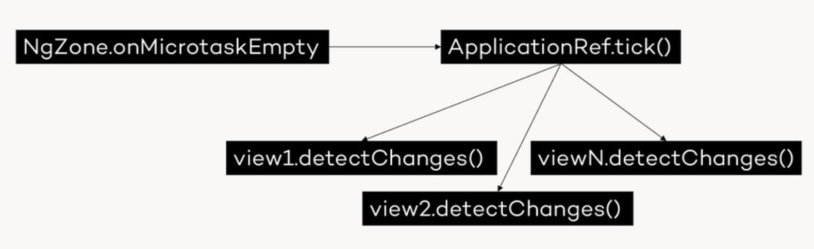
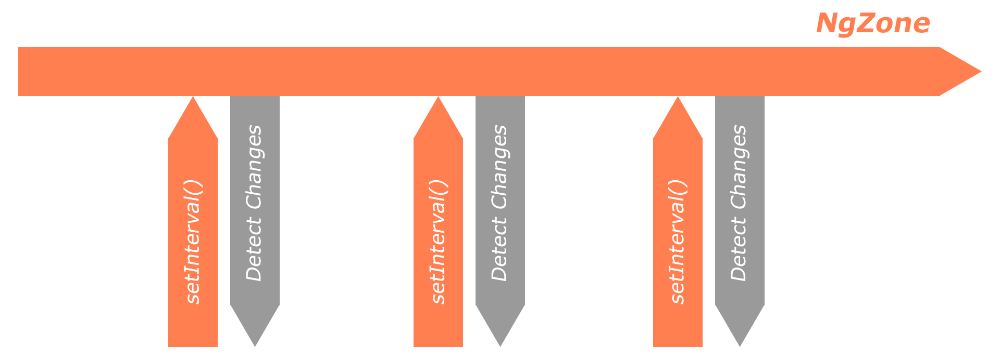
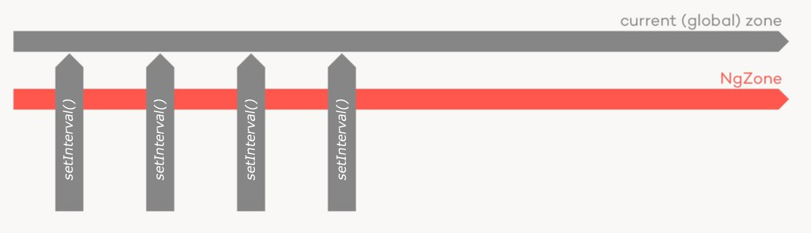

<h1 align="center">Angular change detection</h1>


<span style="background-color: coral;font-weight:bold;color:#2d2d2d; padding: 5px; border-radius: 3px; display:inline-block; margin: 15px 0 0 5px;">#AdvancedZone</span>
<span style="background-color: coral;font-weight:bold;color:#2d2d2d; padding: 5px; border-radius: 3px; display:inline-block; margin: 5px 0 0 5px;">#macroTaskCount</span>
<span style="background-color: coral;font-weight:bold;color:#2d2d2d; padding: 5px; border-radius: 3px; display:inline-block; margin: 5px 0 0 5px;">#zone.onHasTask</span>
<span style="background-color: coral;font-weight:bold;color:#2d2d2d; padding: 5px; border-radius: 3px; display:inline-block; margin: 5px 0 0 5px;">#zone.js</span>
<span style="background-color: coral;font-weight:bold;color:#2d2d2d; padding: 5px; border-radius: 3px; display:inline-block; margin: 5px 0 0 5px;">#asyncPipe</span>
<span style="background-color: coral;font-weight:bold;color:#2d2d2d; padding: 5px; border-radius: 3px; display:inline-block; margin: 5px 0 0 5px;">#signals</span>
<span style="background-color: coral;font-weight:bold;color:#2d2d2d; padding: 5px; border-radius: 3px; display:inline-block; margin: 5px 0 0 5px;">#zonelessApp</span>
<span style="background-color: coral;font-weight:bold;color:#2d2d2d; padding: 5px; border-radius: 3px; display:inline-block; margin: 5px 0 0 5px;">#changeDetectionStrategy</span>
<span style="background-color: coral;font-weight:bold;color:#2d2d2d; padding: 5px; border-radius: 3px; display:inline-block; margin: 5px 0 0 5px;">#markForCheck()</span>
<span style="background-color: coral;font-weight:bold;color:#2d2d2d; padding: 5px; border-radius: 3px; display:inline-block; margin: 5px 0 0 5px;">#changeDetectorRef</span>
<span style="background-color: coral;font-weight:bold;color:#2d2d2d; padding: 5px; border-radius: 3px; display:inline-block; margin: 5px 0 0 5px;">#aplicationRef.tick()</span>
<span style="background-color: coral;font-weight:bold;color:#2d2d2d; padding: 5px; border-radius: 3px; display:inline-block; margin: 5px 0 0 5px;">#rxLet</span>
<span style="background-color: coral;font-weight:bold;color:#2d2d2d; padding: 5px; border-radius: 3px; display:inline-block; margin: 5px 0 0 5px;">#viewTree</span>
<span style="background-color: coral;font-weight:bold;color:#2d2d2d; padding: 5px; border-radius: 3px; display:inline-block; margin: 5px 0 0 5px;">#non-publicProvider</span>
<span style="background-color: coral;font-weight:bold;color:#2d2d2d; padding: 5px; border-radius: 3px; display:inline-block; margin: 5px 0 0 5px;">#ngZoneEventCoalescing</span>

---

### Introduction

Understanding how Angular manages and detects changes is crucial for building responsive and efficient applications. This page delves deep into key concepts such as `Zone.js`, dirty checking, ChangeDetectorRef, ApplicationRef, signals, as well as the choice between "OnPush" and the default change detection strategy.

---

### What is change detection?

Angular employs a mechanism to track and update the application's state. This mechanism automatically identifies and updates the DOM elements when the application's data/model changes. It monitors the components' properties and triggers updates to keep the user interface in sync with the underlying data model.

### 10,000-foot overview

When an Angular application starts, it creates a view for each component and stores it. Angular keeps track of all of the template bindings in these views, and it also gets **notified** when any changes occur to them. When this happens, it triggers the **change detection process**.

### Zone.js - How does Angular get notified when a binding has changed?

At the heart of change detection lies the concept of **Zones**, which play a pivotal role in managing asynchronous operations within an Angular application.

`Zone.js`
is a library that provides a mechanism to manage and track asynchronous operations in JavaScript.

`Zone.js` patches most standard web APIs (such as DOM events, XMLHttpRequest, etc.). This monkey-patching allows `Zone.js` to monitor and manage these asynchronous operations.

**Simplified example of how Zone.js monkey-patches a web API**

```javascript
const originalXHROpen = XMLHttpRequest.prototype.open;

XMLHttpRequest.prototype.open = function (method, url, async, user, password) {
  // do whatever like notify Angular changes are taking place
  console.log(
    "XMLHttpRequest is being opened with method:",
    method,
    "and url:",
    url
  );
  return originalXHROpen.apply(this, arguments);
};
```

Most of the time, when such an operation occurs, it causes bindings to change. `Zone.js` is used to let Angular know about it. Consequently Angular starts the process of change detection by marking the components that need to be checked as **dirty**.

### How change detection works

At application bootstrap, Angular creates a component tree. Each component in the tree has an associated view containing its particular template bindings.
Angular only knows from `Zone.js` that an event was triggered. However, it does not know where the changes occurred, therefore it has to initiate a top-down **dirty check** of the **whole** component/view tree.

When checking each component for changes, Angular simply compares the current value of the component template bindings to the previously stored value. In the event of a change, Angular will mark the component as **dirty**.

### Change detection deep dive (Change detector ref and Application ref)

Each component has its own instance of the _change detector_ which can be accessed via injecting the `ChangeDetectorRef`:

```typescript
@Component({
  selector: "app-root",
  standalone: true,
  template: `<button (click)="markComponentAsDirty()">Click me</button>`,
})
export class App {
  readonly cdRef = inject(ChangeDetectorRef);
  markComponentAsDirty() {
    this.cdRef.markForCheck();
  }
}
```

The change detector is used at the component level and is responsible for marking a component dirty and signaling Angular to initiate a new change detection cycle only for that specific component and its children, it implements the following methods:

- `detach`
- `reattach`
- `markForCheck`
- `detectChanges`

`detach()/reattach()` <br>
As the name implies it detaches the change detector from the component. When this happens, Angular will stop monitoring the component for changes. Thus, the component will not be included in the change detection cycle until the change detector is reattached using the reattach method.

`markForCheck()` vs `detectChanges()` <br>
The main difference between these two methods is that `detectChanges()` tells Angular to immediately run a change detection cycle while `markForCheck()` marks the component and its ancestors as dirty and schedules a change detection cycle to run later, during the regular change detection process. Therefore `detectChanges()` is synchronous and should not be called directly.

`ApplicationRef.tick()` <br>
The `tick()` method in `ApplicationRef` triggers change detection synchronously. When you call `tick()`, Angular immediately runs the change detection process for the entire application.
`AplicationRef.tick()` loops through all the views in the application and calls `detectChanges()` on each of them.
Another way to trigger change detection on the whole application is to bypass `tick()` by directly calling `detectChanges()` on the app-component (the root component of the application).

```typescript
export class ApplicationRef {
  tick(): void {
    //... other stuff

    try {
      this._runningTick = true;
      for (let view of this._views) {
        view.detectChanges();
      }
      if (typeof ngDevMode === "undefined" || ngDevMode) {
        for (let view of this._views) {
          view.checkNoChanges();
        }
      }
    } catch (e) {
      // Attention: Don't rethrow as it could cancel subscriptions to Observables!
      this.internalErrorHandler(e);
    } finally {
      this._runningTick = false;
    }
  }
}
```

[Source: Angular/packages/core/src/application/application_ref.ts](https://github.com/Angular/Angular/blob/main/packages/core/src/application/application_ref.ts)

### Change detection strategies: "On-Push/CheckOnce" vs "Default/CheckAlways"

To prevent Angular from inefficiently checking the entire component tree, we can use `ChangeDetectionStrategy.OnPush`. This strategy optimizes change detection by marking a component for checking only when:

- The component's `@Input()` binding value or reference changes.
- A bound event handler in the component (e.g., 'onClick') is triggered.
- The component emits an event using `EventEmitter` via `@Output()`.
- The Async Pipe receives a new value in the template (async pipe calls `markForCheck()`).
- The component is manually marked as dirty using `ChangeDetectorRef.markForCheck()` or `DetectChanges()`.

By employing the `onPush` change detection strategy in Angular, a component will only be marked for checking when specific conditions are met. This avoids unnecessary checks, ensuring that the component is updated in response to relevant changes, and optimizes the overall performance of the application.

Even though it's best to avoid dirty checking, Angular's change detection algorithm is highly efficient. Unless unintentional change detection loops occur, the real-world performance gains are usually minimal in most cases. However, this approach provides a much clearer component design by enforcing the use of the async pipe and the **view-model pattern**.

The view model pattern involves creating an interface that contains all the data required to render a component's template. Then, you create an Observable that provides this data via a property, often named `$vm`

```typescript
interface MyComponentViewModel {
 data: string;
 // Other properties...
}

class MyComponent {
 vm$: Observable<MyComponentViewModel>;

 constructor(private myService: MyService) {
   this.vm$ = this.myService.getData().pipe(
     map(data => ({ data }))
   );
 }
}

<div *ngIf="vm$ | async as vm">{{ vm.data }}</div>
```

### Fun Zone (Zonejs deep dive)

<span style="background-color: coral;font-weight:bold;color:#2d2d2d; padding: 5px; border-radius: 3px; display:inline-block; margin: 5px 0 0 5px;">#AdvancedZone</span>

Even if `Zone.js` has been moved to the Angular monorepo we can still install it and use it in non Angular javascript projects: `npm install zone.js`

You may wonder what `Zone.js` can do besides notify Angular about async operations?
Well, it provides the following:

- execution context between the async operation
- async life cycle hooks
- unified async Error handling mechanism

**Execution context** <br>
_Zones are meant to help with the problems of writing asynchronous code. They are designed as a primitive for context propagation across multiple logically-connected async operations._

`Zone.wrap` is used to wrap all async callbacks to ensure they run in a specific zone's context.<br>
`Zone.run` is employed to make a specified callback run in a particular zone, helping maintain the async context.

```javascript
var zoneA = Zone.current.fork({ name: "zoneA" });

function callback() {
  console.log("callback is invoked in context", Zone.current.name);
}

zoneA.run(function () {
  console.log("I am in context", Zone.current.name);
  setTimeout(zoneA.wrap(callback), 100);
});
```

**Zone.js setTimeout monkey-patch implemented with run and wrap**

```javascript
var originalDelegate = window.setTimeout;
window.setTimeout = function (callback, delay) {
  var zone = Zone.current;
  originalDelegate.call(
    window,
    function () {
      zone.run(callback);
    },
    delay
  );
};
```

**Async life cycle hooks** <br>
_With these hooks, Zone can monitor and intercept all lifecycles of async operations._

- `onScheduleTask`, this callback will be called before the async operation is scheduled, which means when the async operation is about to be sent to the browser (or NodeJS) to be scheduled to run later.
- `onInvokeTask`, this callback will be called before the async callback is invoked.
- `onHasTask`, this callback will be called when the task queue’s status change between empty and not empty.

```javascript
var zone = Zone.current.fork({
  name: "hook",
  onScheduleTask(delegate, current, target, task) {
    console.log("schedule ZoneTask", task.type, task.source);
    return delegate.scheduleTask(target, task);
  },
  onInvokeTask(delegate, current, target, task, applyThis, applyArgs) {
    console.log("invoke ZoneTask", task.type, task.source);
    return delegate.invokeTask(target, task, applyThis, applyArgs);
  },
  onHasTask(delegate, current, target, hasTaskState) {
    console.log("hasTask state: ", hasTaskState);
    return delegate.hasTask(target, hasTaskState);
  },
});
zone.run(() => {
  setTimeout(function () {
    console.log("timer callback invoked");
  }, 1000);
});
```

`Zone.js` interacts with the JavaScript event loop's macrotask queue in several ways:

It wraps all async operations in a `Task` data structure, which holds all the information of the operation.

Before calling the original function (like `setTimeout`), `Zone.js` calls the `onScheduleTask` callback. After scheduling a new task, it increases the `macroTaskCount` inside the zone and checks if `macroTaskCount` was zero before this new task. If it was, it calls `zone.onHasTask({macroTask: true})`. This method is called when the `macroTaskCount` was previously zero and a new macro task has been scheduled.

After invoking a task, which means the asynchronous operation has finished, `Zone.js` decreases the `macroTaskCount` inside the zone. It also checks if `macroTaskCount` is zero after this task. If it is, it calls `zone.onHasTask({macroTask: false})`. This indicates that there are no more macrotasks in the queue.

`Zone.js` also wraps the callback of asynchronous operations. Before calling the actual callback, it calls the `onInvokeTask` callback. This is done to allow `Zone.js` to intercept the execution of the callback.

**Macro vs Micro tasks** <br>

`Zone.js` treats macrotasks and microtasks differently due to the timing of their execution. Macrotasks are processed in the order they appear in the macrotask queue, while microtasks are processed as soon as possible, right after the currently executing script and any tasks in the macrotask queue.

**Macrotasks**: Macrotasks are tasks that are placed on the macrotask queue such as `setTimeout`, `setInterval`, `requestAnimationFrame`, and I/O operations. When a macrotask is scheduled, `Zone.js` increases the `macroTaskCount` inside the zone and calls the `onHasTask({macroTask: true})` callback. After a macrotask is invoked or cancelled, `Zone.js` decreases the `macroTaskCount` and calls the `onHasTask({macroTask: false})`

**Microtasks**: Microtasks are tasks that are placed on the microtask queue such as `Promise.then`, `process.nextTick`, and `queueMicrotask`. Unlike macrotasks, microtasks are processed as soon as possible, right after the currently executing script and any tasks in the macrotask queue. When a microtask is scheduled, `Zone.js` calls the `onHasTask({microTask: true})` callback. After a microtask is invoked, `Zone.js` calls the `onHasTask({microTask: false})` callback.


**Unified async Error handling mechanism** <br>

Composability<br>
Zones can be composed together through `Zone.fork()`. A child zone may create its own set of
rules and is expected to either:

- Delegate the interception to a parent zone, and optionally add before and after wrapCallback hooks.
- Process the request itself without delegation.

Composability allows zones to keep their concerns clean. For example, a topmost zone may choose to do error handling, while child zones may choose to do user action tracking.

Root Zone<br>
At the start the browser will run in a special root zone, which is configured to behave exactly like the platform, making any existing code that is not zone-aware behave as expected. All zones are children of the root zone.

**Furhter Zone.js readings**<br>

- [Zone.js execution context deep dive](https://medium.com/ngconf/deep-dive-into-zone-js-part-1-execution-context-92166bbb957)
- [Zone.js lifeCycle Hooks deep dive](https://medium.com/ngconf/deep-dive-into-zone-js-part-2-lifecycle-hooks-169da568227e)
- [Zone.js task execution flows](https://github.com/Angular/zone.js/blob/master/doc/task.md)

### NgZone

When an Angular application is bootstrapped, the `NgZone` service is forked from the global zone.
The `NgZone` constructor creates internally a child zone using the `Zone.fork()` method. This child zone is the `NgZone`.



`NgZone` inherits certain characteristics from the global zone, such as the zone's execution context and behavior.
Any asynchronous operations (such as promises, timers, and events) initiated within the `NgZone` will be executed within the context of the `NgZone` thus triggering a change detection cycle.

Once all micro tasks have completed execution, `Zone.js` calls the `onHasTask({microTask: false})` callback. Subsequently triggering the internal Angular `onMicrotaskEmpty` `EventEmitter`. Within the `NgZoneChangeDetectionScheduler` class, we observe that `this.applicationRef.tick()` is invoked, initiating a global change detection cycle.

```typescript
export class NgZoneChangeDetectionScheduler {
  private readonly zone = inject(NgZone);
  private readonly applicationRef = inject(ApplicationRef);

  private _onMicrotaskEmptySubscription?: Subscription;

  initialize(): void {
    if (this._onMicrotaskEmptySubscription) {
      return;
    }

    this._onMicrotaskEmptySubscription = this.zone.onMicrotaskEmpty.subscribe({
      next: () => {
        this.zone.run(() => {
          this.applicationRef.tick();
        });
      },
    });
  }

  ngOnDestroy() {
    this._onMicrotaskEmptySubscription?.unsubscribe();
  }
}
```

[Source: Angular/packages/core/src/change_detection/scheduling/ng_zone_scheduling.ts](https://github.com/Angular/Angular/blob/5e84d9c8c3fa673161566f9d4e6499b2357b7634/packages/core/src/change_detection/scheduling/ng_zone_scheduling.ts#L31)



**Why does all of this matter?**<br>
We now understand that every async event generated in Angular (inside `NgZone`) triggers a change detection cycle. So if we were to have the following code running in our application.

```typescript
export class TimerComponent implements OnInit {
  counter = 0;
  ngOnInit() {
    ``setInterval``(() => {
      // Increment the counter every second
      this.counter++;
    }, 1000);
  }
}
```

Our `NgZone` context will look something like this:<br><br>


As we can see this is very problematic given that every `setInterval` execution tells `Zone.js` to signal a new change detection cycle in Angular. This can cause an incredible performance impact especially if the application doesn't use `ChangeDetectionStrategy.OnPush`, running this type of code inside `NgZone` can cause a lot of hard to-solve bugs and odd behaviors especially if 3rd party libraries are being used in the project.

It is not common to use `setInterval` or `setTimeOut` in our Angular apps but we might want to use 3rd party 3D libraries such as [Threejs](https://threejs.org/) or webGL. These libraries use a lot the `requestAnimationFrame()` microtask. To avoid unwanted change detection cycles, Angular provides us with access to `NgZone`. Using it we can run async heavy code "outside of Angular" in the parent\global zone form which `NgZone` was forked.

Therefore our `NgZone` context will look like this now. <br><br>


We can access the `NgZone` service in a component by injecting it via the component's constructor:

```typescript
import { Component, NgZone } from "@Angular/core";
@Component({
  selector: "app-example",
  template: "<p>Example Component</p>",
})
export class ExampleComponent {
  constructor(private ngZone: NgZone) {
    this.ngZone.runOutsideAngular(() => {
      // Run code outside the Angular zone
      setTimeout(() => {
        // This code will run inside Angular zone
        this.ngZone.run(() => {
          console.log("Code executed inside Angular zone");
        });
      }, 1000);
    });
  }
}
```

### ZoneJs Performance optimization(Event coalesing, Zonless app)

**Event Coalescing** <br>
If we want to further improve the performance of your Angular application we can use a feature of `Zone.js` called _Even Coalescing_.
Via event coalescing, `Zone.js` offers us a way in which we can group or coalesce multiple asynchronous events into a single task.

When multiple asynchronous events happen in short timespan, such as several asynchronous tasks or callbacks occurring almost simultaneously, `Zone.js` can coalesce them into a single task. This helps in optimizing performance and reducing unnecessary overhead. Rather than triggering separate change detection cycles for each event. Coalescing allows Angular to process events together in a more efficient manner.

It can be enabled in `main.ts` by including the `ngZoneEventCoalescing:true` property at application bootstrap.

```typescript
import { platformBrowserDynamic } from "@Angular/platform-browser-dynamic";
import { AppModule } from "./app/app.module";

platformBrowserDynamic()
  .bootstrapModule(AppModule, {
    ngZoneEventCoalescing: true,
  })
  .catch((err) => console.error(err));
```

Event coalescing is a powerful tool for improving performance in Angular applications, but it should be used judiciously because in some cases it can lead to unexpected behavior, so always test thoroughly when enabling this feature.

**Disabling Zone.js patches** <br>
Another more surgical way in which you can optimize `Zone.js` performance is by disabling its monkey-patching on specific web APIs. This can be achieved by using `__Zone_disable_*` flags before importing `Zone.js`, the best place for these flags is in the `polyfills.ts` file.
Here is an example of disabling the `setTimeout` and `requestAnimationFrame` patches:

```typescript
(window as any).__Zone_disable_timers = true;
(window as any).__Zone_disable_requestAnimationFrame = true;
import "zone.js/dist/zone";
```

Disabling `Zone.js` patches globally might not be the best approach in every case. If you only need to prevent change detection for certain parts of your code, consider using `NgZone`'s `runOutsideAngular` method.

**Zoneless Apps**

As explained, we can trigger change detection manually on a component or global level; therefore, we can theoretically build and run an Angular application without using `Zone.js`.

Why would we want to do that instead of just using `ChangeDetectionStrategy.onPush` across all of our components and running some code outside of Angular with `ngZone.runOutsideAngular()`?

Due to the nature of `Zone.js` monkey-patching EVERY web API, this creates a lot of overhead for any application implementing it. Even if our modern hardware can seamlessly run this overhead, if performance optimization is paramount, this could be a viable option in some scenarios.

Possible side effects of running a zoneless Angular application:

- Loss of Automatic Change Detection (obviously): Disabling zones may require manual triggering of change detection, impacting data binding and updates.
- Router navigation events not triggering `ngOnInit()` on components.
- Limited Integration with External Libraries: Many third-party libraries and frameworks integrate with Angular through zones. Disabling zones may lead to compatibility issues or loss of certain features in these libraries.
- Reduced Integration with Angular Features: Certain Angular features, like `@HostListener` and `@ViewChild`, rely on zones. Disabling zones may limit or break the some of the functionality of these features.
- `markForChanges()` does not work.

If you choose to go this route here's how to do it:<br>
Firstly, we cannot bootstrap the application without providing `Zone.js`. We can bypass this by using the non-public provider (theta) `NoopNgZone`. Here is an example of bootstrapping a zoneless application with a stand-alone component instead of a module.

```typescript
import { bootstrapApplication } from "@Angular/platform-browser";
import { AppComponent } from "./app/app.component";
import { ApplicationRef, NgZone, ɵNoopNgZone } from "@Angular/core";
import { provideRouter } from "@Angular/router";
import { APP_ROUTES } from "./app/app.routes";

bootstrapApplication(AppComponent, {
  providers: [
    { provide: NgZone, useClass: ɵNoopNgZone },
    provideRouter(APP_ROUTES),
  ],
});
```

Secondly, we need to manually trigger global change detection on router navigation events so that our components' lifecycle hooks will work properly.

```typescript
export class AppComponent {
  constructor(private router: Router, private applicationRef: ApplicationRef) {
    this.zonelessRouterStarter(router, applicationRef); // make sure router navigation calls ngOnInitHook of components
  }

  private zonelessRouterStarter(
    router: Router,
    applicationRef: ApplicationRef
  ): void {
    router.events
      .pipe(
        filter((event) => event instanceof NavigationEnd),
        takeUntilDestroyed()
      )
      .subscribe(() => {
        applicationRef.tick(); // runs detectChanges() (synchronously) and calls view.dectecChanges() for all app views
        // markForChanges() doesn't work without Zone.js
      });
  }
}
```

Since the `async` pipe will not work (because it calls `markForChanges()`) we have to use alternatives such as `*rxLet` from [RxAngular](https://www.rx-Angular.io/docs/template).

### Angular v17 change detection with Signals

Angular Signals are a new feature introduced in Angular v16 that enhances Angular's reactive programming capabilities and change detection features. Signals are a reactive primitive that provide a way for the code to inform the templates (and other code) that the data has changed.

When a signal's value changes, Angular's change detection automatically updates any view that reads the signal.
The Angular team refers to this as the golden rule of signal components: "Change detection for a component will be scheduled when and only when a signal read in the template notifies Angular that it has changed"

By using signals, Angular can provide finer control over change detection, potentially improving performance.

At the heart of this new of change detection method are the new signal-based components. These components receive their input as signals.

**Singal-based components vs on-push components** <br>
You might ask why to use signal-based components when you can just set the `changeDetectionStragey` to on push, thus making normal components behave like signal-based ones. That is, both will trigger change detection only when the inputs change. BBut the key difference is that when a normal component inputs change, Angulars change detection is still triggered by `Zone.js` and has to run (depending on changeDetectionStragey) on other not-affected components as well.On the other hand, signal-based components notify Angular's change detection mechanism via signals to run only on the affected component thus enabling surgical and zoneless change detection.

When an OnPush component uses a signal's value in its template, Angular will track the signal as a dependency of that component. When that signal is updated, Angular automatically marks the component to ensure it gets updated the next time change detection runs.

The Angular team is hopeful, once all the remaining RFC regarding signals are closed and implemented, that developers will be able to fully implement Angular projects with `Zone.js` as an optional.

It's important to note that signal-based components are still in the developer preview phase in Angular v17 and may not be suitable for production use.
