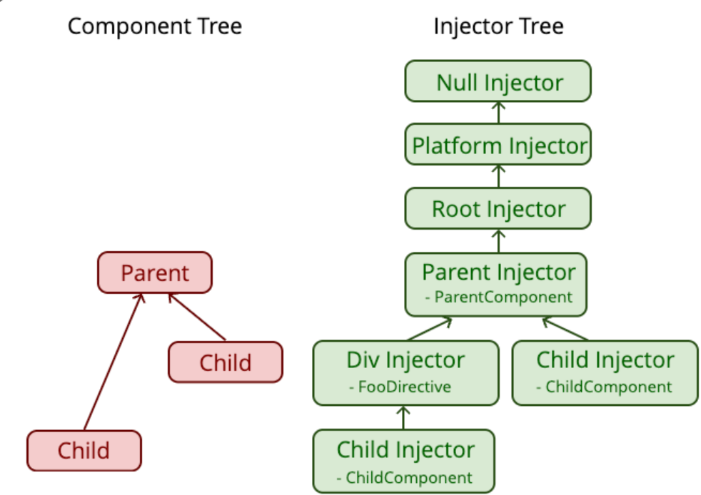

<h1 align="center">Angular dependency injection</h1>


<span style="background-color: coral;font-weight:bold;color:#2d2d2d; padding: 5px; border-radius: 3px; display:inline-block; margin: 15px 0 0 5px;">#PlatformInjector</span>
<span style="background-color: coral;font-weight:bold;color:#2d2d2d; padding: 5px; border-radius: 3px; display:inline-block; margin: 5px 0 0 5px;">#Injectable</span>
<span style="background-color: coral;font-weight:bold;color:#2d2d2d; padding: 5px; border-radius: 3px; display:inline-block; margin: 5px 0 0 5px;">#InjectionToken</span>
<span style="background-color: coral;font-weight:bold;color:#2d2d2d; padding: 5px; border-radius: 3px; display:inline-block; margin: 5px 0 0 5px;">#@SkipSelf</span>
<span style="background-color: coral;font-weight:bold;color:#2d2d2d; padding: 5px; border-radius: 3px; display:inline-block; margin: 5px 0 0 5px;">#NullInjectorError</span>

---

# Introduction

### Hierarchy from the root (null) to a component-level provider:

```
null
  ↑
PlatformInjector
  ↑
RootInjector (AppModule or Standalone)
  ↑
ModuleInjector (optional, lazy-loaded/feature)
  ↑
ComponentInjector (@Component.providers)
  ↑
ElementInjector (per DOM node)
```

---

**Angular's DI hierarchy starts with `null`.**

- This is the **end of the chain**, meaning that if a dependency isn't found anywhere up the injector tree, Angular throws a `NullInjectorError`.

**Platform Injector** (`platformBrowserDynamic().bootstrapModule(AppModule)`)

- Created when Angular starts the app.
- Provides **low-level services** like DOM sanitization, error handling, test scaffolding, etc.
- Rarely used directly, but it's the **root of the injector tree**.

**Root Injector** (a.k.a. **Standalone Environment Injector** or **AppModule Injector**)

- Created when bootstrapping `AppModule` or standalone components.
- Provides:
  - `@Injectable({ providedIn: 'root' })` services
  - Any service declared in `providers: []` of `AppModule`
- **Singletons** live here **for the app's lifetime**.
- It’s what we usually mean by “global” service scope.

**Module Injector(s)** (Optional)

- Only applies if you explicitly provide services in **feature modules** via `providers: []`.
- But: **`providedIn: 'root'` makes this irrelevant most of the time.**
- Still useful for:
  - Lazy-loaded modules → Each has its **own child injector**
  - Feature isolation or scoped services

**Component Injector** (via `@Component({ providers: [] })`)

- If you provide a service in a component’s `providers` array:
  - A **new instance** is created for that component and its **component subtree**.
  - Good for **stateful** or **context-specific** services (e.g., dialogs, forms).
- Also used in **directive-level DI** (same injector scope as the host component).

**Element Injector Tree** (per DOM element)

- Each Angular element (component or directive) has its **own injector**.
- These injectors form a **tree** that mirrors the **component DOM hierarchy**.
- Angular climbs **up this tree** when resolving dependencies at runtime.

---

# DI decorators

(`@SkipSelf`, `@Self`, `@Optional`, `@Host`) give you **fine control over Angular's injector resolution behavior**.

### 🔹 `@Self()`

**➡ Look only in the current injector.**

- If the service isn't found **in the current injector**, Angular throws an error.

```ts
constructor(@Self() myService: MyService) {}
```

**Use case:** You want to enforce that the dependency must be provided **locally**, like in the component’s `providers`.

---

### 🔹 `@SkipSelf()`

**➡ Skip the current injector and look in ancestors only.**

- Ignores the local injector (the current element's injector).
- Useful when a service might be shadowed locally, but you want the **parent version**.

```ts
constructor(@SkipSelf() myService: MyService) {}
```

**Use case:** You override a service locally, but a child component still wants the parent’s instance (e.g., nested forms or hierarchical logging).

---

### 🔹 `@Host()`

**➡ Look only in the host element’s injector and up the tree until reaching the host.**

- **Stops climbing** once it reaches the host component’s injector.
- Does **not** look beyond the host.

```ts
constructor(@Host() myService: MyService) {}
```

**Use case:** You have a directive or child component, and you want to get a dependency from the **host component**, but not from the root or module injector.

---

### 🔹 `@Optional()`

**➡ Makes the dependency optional.**

- If Angular can’t resolve it, instead of throwing, it injects `null`.

```ts
constructor(@Optional() myService: MyService | null) {}
```

**Use case:** Your component can function with or without the dependency (like feature toggles or optional parent components).

---

### 🧠 You Can Combine Them:

```ts
constructor(
  @Optional() @SkipSelf() service: MyService | null
) {}
```

- This says: **try to resolve it from parent injectors, but if it’s not there, inject null instead of throwing.**

---

### 🧪 Interview Scenarios:

- Nested reactive forms needing `FormGroupDirective` from the parent? 👉 `@SkipSelf()`
- Optional parent-child component interaction? 👉 `@Optional()`
- You want to ensure a directive only uses the host component’s provider? 👉 `@Host()`

---

# Misc / OtherTopics

## 🧪 Pure vs Impure Pipes in Angular

### ✅ **Pure Pipes** (default behavior)

> Angular only calls pure pipes **when the input reference changes**.

```ts
@Pipe({
  name: "myPurePipe",
  pure: true, // This is the default
})
export class MyPurePipe implements PipeTransform {
  transform(value: any): any {
    // transform logic
  }
}
```

#### 🔹 How It Works:

- Called **only** when Angular detects a change in the input value **by reference** (using `===`).
- No re-evaluation if internal properties change (e.g., a new item added to the same array object).

#### 🔸 Pros:

- Super performant.
- Ideal for **stateless transforms** (e.g., formatting numbers, strings, enums).

#### 🔸 Cons:

- Doesn’t detect **mutation** within objects or arrays.
- You must replace the whole object (immutability) to trigger a re-evaluation.

---

### ❗ **Impure Pipes**

> Angular calls impure pipes **on every change detection cycle**, regardless of input reference.

```ts
@Pipe({
  name: "myImpurePipe",
  pure: false,
})
export class MyImpurePipe implements PipeTransform {
  transform(value: any): any {
    // transform logic
  }
}
```

#### 🔹 How It Works:

- Evaluated **every time** Angular runs change detection — even if the input hasn't changed.
- Angular treats it like it could return a different output every time.

#### 🔸 Pros:

- Useful for things that **constantly change**, like:
  - Filtering or sorting arrays **without changing the reference**
  - Fetching data dynamically
  - Pipes that depend on **global state** (e.g., current time, translations)

#### 🔸 Cons:

- **Very expensive** in large templates or complex UIs.
- Should be avoided unless necessary.

---

### 📌 When to Use Each:

| Use Case                       | Pipe Type | Example                                                |     |
| ------------------------------ | --------- | ------------------------------------------------------ | --- |
| Format string, date, or number | Pure      | `currency`, `uppercase`, etc.                          |     |
| Sort/filter a live array       | Impure    | `*ngFor="let x of items                    \| filter"` |     |
| Translate dynamic keys         | Impure    | i18n pipes                                             |     |
| React to object mutation       | Impure    | Use only if immutable design isn't possible            |     |

---

### 🧠 Interview Pro Tip:

If they ask: *"Why is using an impure pipe in `*ngFor` discouraged?"\*

- Answer: **Because it gets called on every CD cycle, potentially causing thousands of executions, degrading performance.**

---

## 🚀 What is **REST**?

**REST** stands for **Representational State Transfer** — it's an **architectural style** for building web APIs using standard HTTP methods.

It’s **not a protocol** (like HTTP), but a set of **guidelines** that helps build scalable, stateless services.

---

### 🧩 Key Concepts of REST:

| Concept               | Meaning                                                                                             |
| --------------------- | --------------------------------------------------------------------------------------------------- |
| **Resource**          | A piece of data (e.g. a `user`, `product`, `order`) — represented by a **URL**.                     |
| **Representation**    | Usually JSON (or XML) data sent to represent the resource.                                          |
| **Stateless**         | Each request contains all info needed — the server **doesn’t store client state** between requests. |
| **Uniform Interface** | Interact with all resources using the same set of HTTP verbs.                                       |

---

### ⚙️ Common HTTP Methods in REST:

| HTTP Verb | Action             | Example                                   |
| --------- | ------------------ | ----------------------------------------- |
| `GET`     | Read a resource    | `GET /users/42` → Get user with ID 42     |
| `POST`    | Create a resource  | `POST /users` with body `{ name: "Ana" }` |
| `PUT`     | Replace a resource | `PUT /users/42` with full user data       |
| `PATCH`   | Update partially   | `PATCH /users/42` with `{ email: "x" }`   |
| `DELETE`  | Remove a resource  | `DELETE /users/42`                        |

---

### 🧠 REST Best Practices (for senior dev interviews):

- Use **nouns** in URLs (`/users`, `/orders/7`), not verbs.
- Stick to **standard HTTP methods**.
- Support **HTTP status codes** (e.g. `200 OK`, `404 Not Found`, `201 Created`).
- Use **query params** for filtering/pagination:  
  `/products?category=phones&page=2`
- Make responses **cacheable** where appropriate.

---

### ❌ What REST is _not_:

- Not tied to JSON (but JSON is popular).
- Not a strict rule set — it's a **style**, not a specification.

---

## 🔥 Part 1: Advanced & Very Advanced Concepts to Know

### 🟦 **Angular (Advanced → Very Advanced)**

1. **Change Detection Strategies**
   - `Default` vs `OnPush`
   - How Signals or Zone-less apps affect it
2. **Dependency Injection Deep Dive**
   - Injector hierarchy, `@Self`, `@Host`, tree shaking
3. **Standalone Components**
   - `bootstrapApplication`, no NgModules, `provide*` functions
4. **Signals & Reactivity**
   - Angular signals, computed, effects
5. **Content Projection & `<ng-content>`**
   - Multi-slot projection, `@ContentChild`, `ngTemplateOutlet`
6. **ViewContainerRef / TemplateRef**
   - Dynamic component and template rendering
7. **Dynamic Forms with `FormArray` and `FormGroup`**
   - Form builder patterns, nested form structure
8. **Custom Structural Directives**
   - Implementing `*myIf`, `*myFor`
9. **Advanced Router Usage**
   - Lazy loading, route resolvers, guards, custom reuse strategies
10. **Micro-frontend Architecture**

- Module Federation, dynamic module loading

---

### 🟨 **JavaScript (Advanced → Very Advanced)**

1. **Closures & Lexical Scoping**
2. **`this` Binding Rules**
   - arrow functions, bind/call/apply
3. **Event Loop & Microtasks**
   - `setTimeout`, `Promise`, `queueMicrotask`, `async/await`
4. **Memory Management**
   - Garbage collection, WeakMap/WeakRef
5. **Prototypes & Inheritance**
   - `__proto__`, `Object.create`, `class` vs function-based
6. **Functional Programming Patterns**
   - Currying, composition, immutability
7. **Reactive Programming with RxJS**
   - Operators, custom observables, multicasting, higher-order observables
8. **Module Systems**
   - ESM, CommonJS, dynamic imports, bundling impact
9. **Security Topics**
   - XSS, CSRF, CORS (from a frontend pov)
10. **Performance Optimization**
    - Debouncing/throttling, virtual DOM, rendering bottlenecks

---

## 🎯 Part 2: Top 10 Hard Angular & JavaScript Senior Interview Questions

### 🔟 **Top Angular Interview Questions (Senior-Level)**

1. **How does Angular's change detection work, and how does `OnPush` differ from `Default`?**
2. **What is the injector tree? How does Angular resolve dependencies at runtime?**
3. **Explain Signals and how they differ from Observables. When would you use each?**
4. **How do you handle dynamic component rendering using `ViewContainerRef`?**
5. **Describe how you’d implement a custom `*ngIf` directive.**
6. **How do you share data between lazy-loaded modules?**
7. **What’s the difference between a declarative and imperative approach in Angular forms?**
8. **When would you use `ngTemplateOutlet`, and how does it compare to content projection?**
9. **What strategies have you used for optimizing performance in large Angular apps?**
10. **Explain how Zone.js integrates with Angular. Can Angular work without Zone.js?**

---

### 🔟 **Top JavaScript Interview Questions (Senior-Level)**

1. **Explain the event loop in detail. What is the difference between microtasks and macrotasks?**
2. **What are closures, and how can they lead to memory leaks?**
3. **How does JavaScript handle async operations internally (e.g., async/await vs Promises)?**
4. **What is the difference between `Object.create` and ES6 `class` syntax?**
5. **How does garbage collection work in JavaScript? When does it fail?**
6. **Explain `call`, `apply`, and `bind` with practical use cases.**
7. **What are WeakMaps and WeakRefs? Why and when should you use them?**
8. **How would you implement a custom debounce or throttle function?**
9. **What are higher-order functions and higher-order components?**
10. **What’s the difference between a shallow and deep copy? How would you implement both?**

---

# Peste ce tre sa ne uitam:

### angular

- [ ] tree shaking
- [ ] provide\* functions
- [ ] ViewContainerRef
- [ ] Forms
- [ ] Directive composition / costume directive

### JS

- [ ] Closures & Lexical Scoping
- [ ] arrow functions, bind/call/apply
- [ ] Garbage collection, WeakMap/WeakRef
- [ ] **proto** vs class
- [ ] es2020 deep copy at etc
- [ ] XSS, CSRF, CORS

#### tree shake

If they ask “How can you optimize bundle size related to services?” — say:

“Use providedIn: 'root' for services instead of adding them to NgModule providers. That makes them tree-shakable if they’re not used, helping reduce bundle size.”

#### provide\_\_\_ functions

YES — this is 🔥 cutting-edge Angular! If they ask about `provide*` functions in a senior interview, you’ll instantly signal that you’re up to date with **standalone components** and Angular’s **new DI model**.

---

## 🧩 What are `provide*()` functions in Angular?

Starting in Angular v14+ (especially with **standalone components**), Angular introduced a set of **utility functions** to configure **providers without needing NgModules**.

These include:

| Function                    | Purpose                               |
| --------------------------- | ------------------------------------- |
| `provideHttpClient()`       | Set up the `HttpClient` provider tree |
| `provideRouter()`           | Configure routing for standalone apps |
| `provideAnimations()`       | Enable animations support             |
| `provideStore()`            | For NgRx store setup                  |
| `provideEffects()`          | For NgRx effects                      |
| `provideEnvironmentMocks()` | For testing                           |

---

## 💡 Why They Matter

Traditionally, you had to use `imports` and `providers` in an `@NgModule`.  
Now, you can do **everything via `bootstrapApplication()`** using these functions:

```ts
bootstrapApplication(AppComponent, {
  providers: [
    provideHttpClient(),
    provideRouter(myRoutes),
    provideAnimations(),
    { provide: MyService, useClass: MyCustomService },
  ],
});
```

---

## 🚀 Benefits of `provide*()`:

✅ **Modular** – no monolithic NgModules needed  
✅ **Tree-shakable** – unused features are stripped out  
✅ **Explicit** – easy to see what’s configured  
✅ **Flexible** – great for micro-frontends or hybrid bootstrapping  
✅ **Supports Signals** and new reactivity without zones

---

## 🧠 Advanced Tip:

If you create your **own custom `provide*()`**, you can bundle feature providers cleanly:

```ts
export function provideChatFeature(): Provider[] {
  return [ChatService, { provide: ConfigToken, useValue: defaultConfig }];
}
```

Then use:

```ts
bootstrapApplication(AppComponent, {
  providers: [provideChatFeature()],
});
```

---

## 📌 When Interviewed, Say Things Like:

> “In standalone Angular, I prefer using `provide*()` functions for cleaner, modular app configuration. They’re tree-shakable, explicit, and reduce boilerplate compared to NgModules. I’ve also written custom `provide*()` functions for internal SDKs or shared features.”

---

#### viewContainerRef

Alright, here comes another senior-level essential: `ViewContainerRef` 🔍 — it’s the backbone of **dynamic view manipulation** in Angular.

---

## 🧱 What is `ViewContainerRef`?

It’s a **service** that Angular injects to let you **programmatically create, insert, and remove views** (components or templates) at runtime.

Think of it as your **handle to the DOM region** where you can dynamically insert Angular-rendered content.

---

## 🔧 Where You Get It From

Usually injected in a directive or component:

```ts
constructor(private vcr: ViewContainerRef) {}
```

Or accessed via `@ViewChild`:

```ts
@ViewChild('myContainer', { read: ViewContainerRef }) vcr!: ViewContainerRef;
```

---

## 🧠 What Can You Do With It?

| Method                 | What It Does                                 |
| ---------------------- | -------------------------------------------- |
| `createComponent()`    | Dynamically creates and inserts a component  |
| `createEmbeddedView()` | Creates a view from a `TemplateRef`          |
| `clear()`              | Clears all views from the container          |
| `insert()`             | Inserts an existing view at a specific index |
| `remove()`             | Removes a view by index                      |
| `get(index)`           | Returns a `ViewRef` at a given index         |

---

## 📌 Real-world Use Cases:

1. **Dynamic component loading** (like modals, dialogs, tooltips)
2. **Custom structural directives** (`*myIf`, `*repeat`)
3. **Template swapping** (e.g., loading skeleton vs data view)
4. **Building component libraries** (e.g., tab containers, dynamic steps)

---

## 🧪 Example 1: Create a Component Dynamically

```ts
const compRef = this.vcr.createComponent(MyComponent);
compRef.instance.title = "Dynamically inserted!";
```

💥 Requires:

- `MyComponent` to be declared as `standalone: true` **or** added to the `entryComponents` in older versions.

---

## 🧪 Example 2: Create a TemplateRef View

```html
<ng-template #tmpl let-name> Hello, {{ name }}! </ng-template>
```

```ts
@ViewChild('tmpl') tmplRef!: TemplateRef<any>;

ngAfterViewInit() {
  this.vcr.createEmbeddedView(this.tmplRef, { $implicit: 'Angular' });
}
```

---

## 🎓 Advanced Tip:

If you're creating components in a **structural directive**, you usually:

- Inject `ViewContainerRef` (where to insert)
- Inject `TemplateRef` (what to insert)

```ts
constructor(
  private vcr: ViewContainerRef,
  private tmpl: TemplateRef<any>
) {}
```

---

## 💡 Interview Pro Insight

If asked:

> “How would you insert a component dynamically, or build a custom `*ngIf`?”

Talk about using `ViewContainerRef.createComponent()` or `.createEmbeddedView()` inside a structural directive or component.

Want me to walk you through building a custom `*ifNot` directive using this?

<ng-container \*ngComponentOutlet="myComponentType"></ng-container>

Nice — here’s a full **unit test suite** for the custom `MultiSelectFormControlComponent` that we just built, using **Jasmine + Angular TestBed**.

---

```ts
import { Component, Input, forwardRef } from "@angular/core";
import {
  ControlValueAccessor,
  NG_VALUE_ACCESSOR,
  NG_VALIDATORS,
  Validator,
  AbstractControl,
  ValidationErrors,
} from "@angular/forms";

@Component({
  selector: "app-multi-select-form-control",
  templateUrl: "./multi-select-form-control.component.html",
  styleUrls: ["./multi-select-form-control.component.css"],
  providers: [
    {
      provide: NG_VALUE_ACCESSOR,
      useExisting: forwardRef(() => MultiSelectFormControlComponent),
      multi: true,
    },
    {
      provide: NG_VALIDATORS,
      useExisting: forwardRef(() => MultiSelectFormControlComponent),
      multi: true,
    },
  ],
})
export class MultiSelectFormControlComponent
  implements ControlValueAccessor, Validator
{
  @Input() options: string[] = [];
  @Input() isRequired = false;

  value: string[] = [];
  touched = false;

  private onChange = (value: string[]) => {};
  private onTouched = () => {};

  toggleSelection(option: string) {
    if (this.value.includes(option)) {
      this.value = this.value.filter((o) => o !== option);
    } else {
      this.value = [...this.value, option];
    }

    this.onChange(this.value);
    this.markAsTouched();
  }

  markAsTouched() {
    if (!this.touched) {
      this.touched = true;
      this.onTouched();
    }
  }

  // CVA methods
  writeValue(value: string[]): void {
    this.value = value || [];
  }

  registerOnChange(fn: (value: string[]) => void): void {
    this.onChange = fn;
  }

  registerOnTouched(fn: () => void): void {
    this.onTouched = fn;
  }

  setDisabledState(isDisabled: boolean): void {
    // Implement if needed
  }

  // Validator interface
  validate(control: AbstractControl): ValidationErrors | null {
    if (this.isRequired && this.value.length === 0) {
      return { required: true };
    }
    return null;
  }
}
```

## ✅ Test File: `multi-select-form-control.component.spec.ts`

```ts
import { ComponentFixture, TestBed } from "@angular/core/testing";
import { MultiSelectFormControlComponent } from "./multi-select-form-control.component";
import { ReactiveFormsModule, FormControl } from "@angular/forms";
import { Component } from "@angular/core";

@Component({
  template: `
    <form>
      <app-multi-select-form-control
        [options]="['Angular', 'React', 'Vue']"
        [isRequired]="true"
        [formControl]="control"
      >
      </app-multi-select-form-control>
    </form>
  `,
})
class TestHostComponent {
  control = new FormControl([], { nonNullable: true });
}

describe("MultiSelectFormControlComponent", () => {
  let fixture: ComponentFixture<TestHostComponent>;
  let host: TestHostComponent;

  beforeEach(async () => {
    await TestBed.configureTestingModule({
      declarations: [MultiSelectFormControlComponent, TestHostComponent],
      imports: [ReactiveFormsModule],
    }).compileComponents();

    fixture = TestBed.createComponent(TestHostComponent);
    host = fixture.componentInstance;
    fixture.detectChanges();
  });

  it("should create the component", () => {
    expect(
      fixture.nativeElement.querySelector("app-multi-select-form-control")
    ).toBeTruthy();
  });

  it("should select and deselect items", () => {
    const buttons = fixture.nativeElement.querySelectorAll("button");
    expect(buttons.length).toBe(3);

    // Click Angular
    buttons[0].click();
    fixture.detectChanges();
    expect(host.control.value).toEqual(["Angular"]);

    // Click React
    buttons[1].click();
    fixture.detectChanges();
    expect(host.control.value).toEqual(["Angular", "React"]);

    // Click Angular again to deselect
    buttons[0].click();
    fixture.detectChanges();
    expect(host.control.value).toEqual(["React"]);
  });

  it("should mark as touched on first interaction", () => {
    expect(host.control.touched).toBe(false);

    const buttons = fixture.nativeElement.querySelectorAll("button");
    buttons[0].click();
    fixture.detectChanges();

    expect(host.control.touched).toBe(true);
  });

  it("should show validation error when required and nothing selected", () => {
    host.control.markAsTouched();
    host.control.setValue([]);
    fixture.detectChanges();

    const error = fixture.nativeElement.querySelector(".error");
    expect(error).toBeTruthy();
    expect(error.textContent).toContain("At least one option is required");
  });

  it("should not show error if valid selection is made", () => {
    host.control.setValue(["Angular"]);
    fixture.detectChanges();

    const error = fixture.nativeElement.querySelector(".error");
    expect(error).toBeFalsy();
  });
});
```

---

## 🧠 What’s Covered in These Tests:

- ✅ Creation of the component
- ✅ Clicking buttons to select/deselect values
- ✅ Syncing value with `FormControl`
- ✅ Touched state detection
- ✅ Validation errors shown/hidden based on state

---

## js

### this

this refers to the execution context of a function.
It’s dynamic by default — depends on how a function is called.

Arrow functions do not have their own this.
Instead, they inherit this from their surrounding scope at the time they are defined. (lexical this)

They let you explicitly set the value of this when invoking a function.

✅ bind(thisArg) → returns a new function with bound context we can partilay bind arguments f(x,y) f.bind(null,1) = x=1 always
✅ call(thisArg, ...args) → invoke immediately
✅ apply(thisArg, argsArray) → same as call, but args passed as array

🔥 Let’s do a **deep, backend-aware dive** into **XSS**, **CSRF**, and **CORS** — three of the most critical security topics for frontend/backend engineers.

You’ll walk away interview-ready with practical knowledge and how to **mitigate these in Node.js/NestJS**.

---

## 🧨 1. **XSS — Cross-Site Scripting**

### 💥 What is it?

> XSS occurs when **malicious scripts are injected into trusted websites**. The script runs in the user's browser and can steal cookies, tokens, or impersonate the user.

### 🧪 Example:

```html
<!-- User input rendered without escaping -->
<div>Welcome, {{ user.name }}</div>
```

If `user.name = "<script>steal()</script>"`, boom 💣 — script executes in the DOM.

---

### 🔧 Types:

| Type          | Trigger                                         |
| ------------- | ----------------------------------------------- |
| **Stored**    | Injected once (e.g. comment field), lives in DB |
| **Reflected** | Sent via query param, reflected in HTML         |
| **DOM-based** | Happens in client-side JS (e.g. `innerHTML`)    |

---

### 🛡️ How to Prevent XSS:

#### ✅ Angular (frontend)

- Angular escapes values in templates **by default**
- Avoid using `innerHTML`, `bypassSecurityTrustHtml`, etc.

#### ✅ Backend (NestJS / Node)

- Always **sanitize** any HTML that users submit
  - Use libs like [`sanitize-html`](https://www.npmjs.com/package/sanitize-html)
  - Or `DOMPurify` on the client side

#### ✅ Set HTTP-only cookies

- So JavaScript **can’t read** tokens, even if XSS lands

#### ✅ CSP Headers

- `Content-Security-Policy: default-src 'self'; script-src 'self'`
- This limits what scripts can execute even if injected

---

## 🧨 2. **CSRF — Cross-Site Request Forgery**

### 💥 What is it?

> CSRF tricks a logged-in user into making an **unintended request** to your server **from another site** (e.g. clicking a hidden form or image).

💡 Unlike XSS, CSRF doesn't steal data — it **exploits the user's session** (e.g., cookies) to perform **state-changing actions**.

---

### 🧪 Example Attack:

```html
<!-- From another website -->
<form action="https://yourapp.com/api/delete" method="POST">
  <input type="hidden" name="userId" value="123" />
  <button style="display:none">Click me</button>
</form>
```

If your app uses **cookie-based auth**, and the user is logged in, this will **succeed** unless CSRF is blocked.

---

### 🛡️ How to Prevent CSRF:

#### ✅ 1. Use **SameSite Cookies**:

- Best modern defense for cookie-based auth

```ts
res.cookie("token", token, {
  httpOnly: true,
  sameSite: "strict", // 'lax' is often good enough
});
```

✅ Prevents cookies from being sent **on cross-origin form submissions**.

---

#### ✅ 2. Use CSRF Tokens (if needed):

- If SameSite isn’t an option (e.g., older browser support), use a **CSRF token** flow:

**NestJS:**

```ts
// With csurf middleware
import * as csurf from "csurf";
app.use(csurf());
```

Expose the CSRF token to frontend via:

```ts
@Get('csrf-token')
getCsrfToken(@Req() req): string {
  return req.csrfToken();
}
```

Frontend then includes it in request headers or body.

---

#### ✅ 3. Avoid Cookies — Use Token Auth

- Token-based auth (e.g. JWT in `Authorization` header) avoids CSRF completely, since:
  > CSRF relies on **automatically sent credentials (like cookies)**

If you store tokens in `localStorage`, **CSRF is not possible**, but **XSS becomes more dangerous** (so combine with CSP, sanitization, etc).

---

## 🧨 3. **CORS — Cross-Origin Resource Sharing**

### 💥 What is it?

> CORS is a **browser security feature** that **blocks frontend JavaScript from making requests to a different origin** unless the backend allows it.

---

### 🧪 Example Scenario:

Frontend: `http://localhost:4200`  
Backend: `http://localhost:3000`

```ts
fetch("http://localhost:3000/api/data");
// ❌ Blocked by CORS unless allowed by server
```

---

### 🛠️ CORS in NestJS

Use built-in support:

```ts
// main.ts
app.enableCors({
  origin: "http://localhost:4200", // or a function for dynamic origin
  credentials: true, // if using cookies
});
```

- `origin`: specifies allowed origins (can be a wildcard, array, or function)
- `credentials: true`: needed for **cookies** to be sent cross-origin

---

### ⚠️ Important:

| Setting                            | What it Affects                                       |
| ---------------------------------- | ----------------------------------------------------- |
| `Access-Control-Allow-Origin`      | Allows specific origins                               |
| `Access-Control-Allow-Credentials` | Must be set for cookies                               |
| `Access-Control-Allow-Methods`     | Specifies allowed methods                             |
| `Access-Control-Allow-Headers`     | Needed if sending custom headers (e.g. Authorization) |

---

### 🔥 Pro Backend Tip:

If your frontend sends credentials (cookies or auth headers), **you must:**

1. Set `credentials: true` in the frontend
2. Enable `Access-Control-Allow-Credentials: true` in backend
3. Use a **non-wildcard origin** (cannot be `*`)

---

## 🔐 Summary Cheat Table

| Threat   | What it Does                         | Prevent With                                         |
| -------- | ------------------------------------ | ---------------------------------------------------- |
| **XSS**  | Script injection                     | Sanitize input, CSP, escape output, httpOnly cookies |
| **CSRF** | Forced requests                      | SameSite cookies, CSRF tokens, avoid cookie auth     |
| **CORS** | Prevents frontend-to-backend fetches | `app.enableCors()`, allow origins explicitly         |

---

Let me know if you want:

- a **NestJS starter template** with CORS + CSRF correctly configured
- or a **vulnerable app** you can use to practice XSS/CSRF attacks safely in dev!
