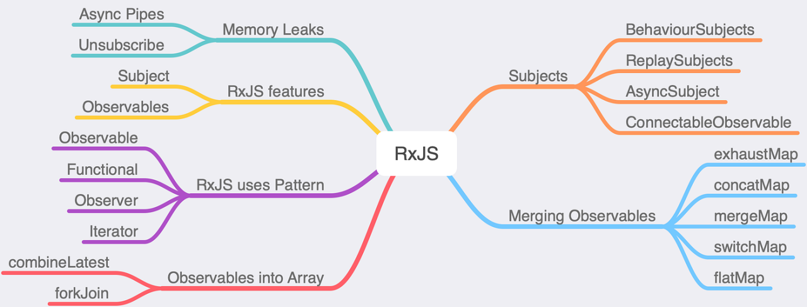

<h1 align="center">Observables: RxJs deep dive</h1>


<span style="background-color: coral;font-weight:bold;color:#2d2d2d; padding: 5px; border-radius: 3px; display:inline-block; margin: 15px 0 0 5px;">#hotNcold</span>
<span style="background-color: coral;font-weight:bold;color:#2d2d2d; padding: 5px; border-radius: 3px; display:inline-block; margin: 5px 0 0 5px;">#shareReply</span>
<span style="background-color: coral;font-weight:bold;color:#2d2d2d; padding: 5px; border-radius: 3px; display:inline-block; margin: 5px 0 0 5px;">#intersectionObserver</span>
<span style="background-color: coral;font-weight:bold;color:#2d2d2d; padding: 5px; border-radius: 3px; display:inline-block; margin: 5px 0 0 5px;">#RxJSInterop</span>
<span style="background-color: coral;font-weight:bold;color:#2d2d2d; padding: 5px; border-radius: 3px; display:inline-block; margin: 5px 0 0 5px;">#errorStream</span>
<span style="background-color: coral;font-weight:bold;color:#2d2d2d; padding: 5px; border-radius: 3px; display:inline-block; margin: 5px 0 0 5px;">#signals</span>
<span style="background-color: coral;font-weight:bold;color:#2d2d2d; padding: 5px; border-radius: 3px; display:inline-block; margin: 5px 0 0 5px;">#switchMap</span>

---

- hot / cold observers / share reply
- generating error streams
- switch map / popular operators
- callback to promise to observer to ngrx component state to observer to signal

# Introduction

[RxJS](https://rxjs.dev/guide/overview), or Reactive Extensions for JavaScript, is a powerful library that brings the paradigm of reactive programming to the world of JavaScript and, specifically, Angular. At its core, RxJS enables developers to handle asynchronous operations, events, and data streams with a unified and elegant approach. It provides one core type, the _Observable_, satellite types (Observer, Schedulers, Subjects) and operators inspired by Array methods (map, filter, reduce, every, etc) to allow handling asynchronous events as collections. With its vast array of operators, RxJS empowers developers to compose and transform data streams efficiently, promoting a declarative and responsive style of coding. In the realm of Angular development, RxJS serves as a cornerstone, facilitating the creation of scalable, maintainable, and reactive applications.

[RxJS: Glossary And Semantics](https://rxjs.dev/guide/glossary-and-semantics)

# Core concepts

## Declarative programming

Declarative programming is a programming paradigm that expresses the logic of a computation without explicitly describing the control flow. In contrast to imperative programming, where the focus is on detailing the step-by-step procedure to achieve a result. Declarative programming emphasizes describing what the program should accomplish. It involves expressing the desired outcome or behavior and letting the underlying system determine the most efficient way to achieve it.

Some common examples include: `HTML`, `SQL Querys`, `Functional Programming`.

```javascript
const numbers = [1, 2, 3, 4, 5];
const doubled = numbers.map((num) => num * 2);
```

Benefits:

- Readability and Maintainability: Declarative code tends to be more readable, making it easier to understand and maintain over time.

- Abstraction of Complexity: By focusing on what needs to be achieved rather than the specific steps, declarative programming can abstract away some of the complexity of a solution.

- Potential for Optimization: Declarative code allows systems to optimize execution based on the desired outcome, potentially leading to more efficient solutions.

RxJS embraces a declarative approach through the use of observable sequences and operator. The declarative nature of RxJS allows developers to focus on describing the desired behavior and let the library handle the underlying complexities of asynchronous programming and event handling.

## Observer (consumer)

In a general programming context, an observer is a behavioral design pattern where an object, known as the observer, maintains a list of dependents, called observers (consumers), that are notified of any state changes. When the observed object undergoes a modification, all its dependents are automatically informed and updated.

In RxJS, an observer is a crucial component of the Observable pattern. An observer is an object with three optional methods: `next()`, `error()`, and `complete()`. These methods define the behavior that will be executed when the observable emits a new value (`next()`), encounters an error (`error()`), or completes its operation (`complete()`).

Here's a breakdown of the observer methods:

- next(value): Invoked when a new value is emitted by the observable. This is where you handle the data produced by the observable.

- error(error): Called when an error occurs during the observable's operation. It allows you to handle and manage errors gracefully.

- complete(): Indicates the completion of the observable. It's called when the observable has finished emitting values. This method is often used for cleanup or finalization tasks.

## Observable

An observable is a central concept and a core building block of reactive programming. It represents a sequence of values or events that may occur over time. Observables can emit these values asynchronously, allowing you to react to them in a non-blocking manner.
Observers are registered to an observable using the `subscribe()` method, establishing a connection between the observable and the observer.

Key characteristics of RxJS observables:

- Emitting Values: Observables can emit a stream of values, and these values can represent any type of data – from simple types like numbers and strings to complex objects.

- Asynchronous: Observables can handle asynchronous operations, making them well-suited for scenarios like handling HTTP requests, user interactions, and other asynchronous events.

- Subscribing: To observe the values emitted by an observable, you subscribe to it. Subscribing involves providing a set of callbacks (often in the form of an observer) that define how to handle the emitted values, errors, and completion.

- Operators: RxJS provides a rich set of operators that allow you to transform, filter, combine, and manipulate the data emitted by observables, enabling a powerful and declarative style of programming.

## Subject (Hot Observable)

In RxJS, a `Subject` is a specialized type of observable that acts as both an observer and an observable. It allows values to be multicasted to many observers. This dual role distinguishes Subject from regular observables, making it a powerful tool for implementing various patterns in reactive programming.

Key features and characteristics of an RxJS `Subject`:

- Multicasting: A Subject serves as a multicast provider, allowing multiple observers to subscribe to the same stream of values. When a Subject emits a new value, all subscribed observers receive the update simultaneously.

- Stateful: Unlike regular observables, Subject maintains an internal state. It keeps track of the latest value that was emitted, making it suitable for scenarios where the current state is crucial.

- Observables and Observers: A Subject can be subscribed to like any other observable, and it can also act as an observer by accepting values via its next() method. This bidirectional nature makes it a versatile tool in scenarios where coordination between different parts of the application is needed.

- Hot Observable: Subject is considered a "hot" observable because it emits values regardless of whether there are active subscribers. This contrasts with "cold" observables, which only produce values when a subscription occurs.

- BehaviorSubject and ReplaySubject: These are specialized versions of the Subject. BehaviorSubject always emits the last value to new subscribers, while ReplaySubject can replay a specified number of previous values to new subscribers.

## Subscription

A `Subscription` is an object that represents the execution of an observable. It is created when you subscribe to an observable and is used to manage the lifecycle of that subscription. Understanding subscriptions is crucial for handling resources efficiently, preventing memory leaks, and controlling the flow of data in your RxJS-based application.

Functionalities associated with an RxJS `Subscription`:

- Creation: When you subscribe to an observable using the `subscribe()` method, it returns a `Subscription` object. This object represents the ongoing execution of the observable.

```javascript
import { interval } from "rxjs";
const observable = interval(1000);
const subscription = observable.subscribe((x) => console.log(x));
subscription.unsubscribe();
```

- Unsubscribing: Subscriptions are primarily used for managing the lifecycle of the observable. When you're done listening to the observable (for example, when a component is destroyed or a certain condition is met), you need to unsubscribe from the subscription. This prevents memory leaks by releasing resources and stopping unnecessary processing.

- Composite Subscriptions: You can combine multiple subscriptions into a single composite subscription. This enables you to manage and unsubscribe from multiple subscriptions at once, simplifying the cleanup process.

```javascript
import { interval } from "rxjs";

const observable1 = interval(400);
const observable2 = interval(300);

const subscription1 = observable1.subscribe((x) => console.log("first: " + x));
const subscription2 = observable2.subscribe((x) => console.log("second: " + x));

subscription1.add(subscription2);

setTimeout(() => {
  // Unsubscribes BOTH subscription1 and subscription2
  subscription1.unsubscribe();
}, 1000);
```

- Subscription Status: You can check the status of a subscription using the closed property. If closed is true, the subscription has been unsubscribed; if false, the subscription is still active.

## Operators

RxJS is mostly useful for its operators, even though the Observable is the foundation. Operators are the essential pieces that allow complex asynchronous code to be easily composed in a declarative manner.

Operators are powerful functions that allow you to transform, filter, combine, and manipulate the data emitted by observables. They provide a declarative and composable way to work with asynchronous data streams, making it easier to express complex asynchronous operations concisely.

There are two kinds of operators: _Pipeable Operators_ and _Creation Operators_

### Pipable operators

Pipable operators in RxJS are a category of operators that are applied using the pipe function. They allow you to chain multiple operators together to compose a sequence of transformations on an observable. Pipable operators are typically used in a more modular and readable way, making it easier to understand and maintain complex asynchronous data flows.

To use pipable operators, you call the pipe function on an observable and pass the operators as arguments.

```javascript
import { of } from "rxjs";
import { map, filter, take } from "rxjs/operators";

const source = of(1, 2, 3, 4, 5);

const pipedObservable = source.pipe(
  map((value) => value * 2),
  filter((value) => value > 5),
  take(2)
);

pipedObservable.subscribe((result) => console.log(result));
```

Pipable operators can be futher classified into the following categories:

- Transformation: Operators like `map`, `pluck`, and `mergeMap` transform the values emitted by an observable. `map` is used to apply a function to each emitted value, while `pluck` extracts a specific property. `mergeMap` (and its variants like `switchMap` and `concatMap`) allows you to transform each value into a new observable and merge their emissions.

- Filtering: Operators such as `filter`, `take`, and `skip` enable you to filter the values emitted by an observable based on specific criteria. `filter` only allows values that satisfy a given condition, take limits the number of values emitted, and `skip` ignores the initial values.

- Combination: Combination operators like `merge`, `concat`, and `combineLatest` help you combine multiple observables into a single observable. They handle scenarios where you need to work with data from multiple sources concurrently.

- Error Handling: Operators like `catchError` and `retry` assist in handling errors emitted by observables. `catchError` allows you to handle errors gracefully by substituting them with a fallback observable, while `retry` resubscribes to the source observable in case of errors, allowing for retry logic.

- Utility: Utility operators such as `tap`, `delay`, and `finalize` provide additional functionality without modifying the values emitted. `tap` allows you to perform side effects without altering the stream, `delay` introduces a delay in emitting values, and `finalize` allows you to run cleanup logic when the observable completes or is unsubscribed.

### Creation Operators

Creation Operators in RxJS are operators that are used to create observables from various data sources or events. These operators are responsible for initializing and emitting values in the observable sequence. They offer a way to kick-start the creation of observables with different types of data, including static values, arrays, timers, and more.

```javascript
import { of, interval, from } from "rxjs";

const observable1 = of("Hello", "World"); // Emit static values
const observable2 = interval(1000); // Emit values over time
const observable3 = from([1, 2, 3, 4, 5]); // Emit values from an array

observable1.subscribe((value) => console.log(value));
observable2.subscribe((value) => console.log(value));
observable3.subscribe((value) => console.log(value));
```

Operators like `of`, `from`, and `interval` are used to create observables. They help in generating observables from static values, arrays, or sequences.

# Deep dive

## HotnCold

### Hot (multicast)

In RxJS, a hot observable is an observable sequence that starts emitting values or events regardless of whether there are any subscribers. It produces data continuously, and subscribers join the stream at the current point in the sequence, potentially missing previously emitted values. Unlike cold observables, where each subscription triggers an independent execution of the observable's logic, hot observables share the same stream of data among all subscribers.

All subscribers to a hot observable share the same execution of the observable's logic. The observable maintains a single stream of data, and subscribers receive values concurrently from that shared stream.

Hot observables are useful when you want to share a single stream of data among multiple subscribers. This is common in scenarios where events or data are produced continuously, and subscribers need to observe the ongoing stream.

Hot observables are often used to handle continuous event streams, such as user interactions, sensor readings, or real-time data updates.

### Cold (unicast)

In RxJS, a cold observable is an observable sequence that starts producing values or events only when an observer subscribes to it. Each subscription to a cold observable triggers the execution of its logic independently for each subscriber. This means that each subscriber receives the entire sequence of values from the beginning, and they operate on their own independent execution of the observable.

Cold observables are suitable for scenarios where you want each subscriber to have its own independent stream of data. This is beneficial when subscribers should not share the emitted values or when each subscription needs to start afresh.

Cold observables can be replayed independently for each subscriber, providing a fresh stream of data for each new subscription

### Unicast / Multicast

Unicatsing means that every new subscriber to an observable creates a new execution context. The code of the observable executes for every `subscribe()` call. In the example below each subscription recives a diverent value, even tho we are subscribing to the same observable.

```javascript
const obs$ = of(null).pipe(map(() => Math.random()));
obs$.subscribe(console.log); // 0.1102..
obs$.subscribe(console.log); // 0.7936..
obs$.subscribe(console.log); // 0.0583..
```

To better understand this behaviour we can think about an observable like as a class and a subscription being like a class instance. All objects created with the `new()` method are created form the same class but each one of them has it own life cycle.

In a cold observable, the data source (e.g., a function, an array, an HTTP request) is typically defined within the observer function or the observable's logic. Each subscription results in the creation of a new, independent execution of the observable's logic, including the data source.

```javascript
import { Observable } from "rxjs";

const coldObservable = new Observable((observer) => {
  const data = [1, 2, 3, 4, 5];

  data.forEach((value) => {
    observer.next(value);
  });

  observer.complete();
});

// Subscriber 1
coldObservable.subscribe((value) => console.log(`Subscriber 1: ${value}`));

// After 3 seconds, Subscriber 2 subscribes
setTimeout(() => {
  coldObservable.subscribe((value) => console.log(`Subscriber 2: ${value}`));
}, 3000);
```

In this example, the data array is part of the observer function, and each subscriber receives the entire sequence independently.

For hot observables the date source is created and activated outside the observer function or the observable's logic. The observable starts emitting values as soon as it is created, and subscribers join the ongoing stream at the current point, potentially missing earlier emissions.

```typescript
import { Subject } from "rxjs";

const dataSubject = new Subject(); // Hot observable with data source outside

// Emit values
dataSubject.next("A");
dataSubject.next("B");
dataSubject.next("C");

// Subscriber 1
dataSubject.subscribe((value) => console.log(`Subscriber 1: ${value}`));

// After 3 seconds, Subscriber 2 subscribes
setTimeout(() => {
  dataSubject.subscribe((value) => console.log(`Subscriber 2: ${value}`));
}, 3000);

// Continue emitting values
dataSubject.next("D");
dataSubject.next("E");
```

In this example, the dataSubject is a hot observable, and both subscribers share the same stream of values emitted by the subject (multicast).

Example of hot observables:

- Any kind of `Subject`
- using `fromEvent()`
- using `fromPromise()`
- using the `share()` and `shareReply()` opertators on a cold observer

In Angular, the distinction between cold and hot observables is evident in various real-life scenarios. Cold observables are frequently employed in situations where independence among subscribers is crucial. For instance, when making HTTP requests using Angular's `HttpClient`, each subscription to the request results in a new execution, enabling multiple components or services to independently fetch and process data from the server. Additionally, cold observables are commonly used to monitor changes in user inputs or form fields and to react independently to alterations in route parameters. Each component subscribing to these observables operates on its own instance, allowing for modular and isolated reactions to the emitted data.

On the other hand, hot observables find application in scenarios that require sharing a single stream of data among multiple subscribers. For real-time communication using `WebSockets`, `WebSockets` create a hot observable where numerous components can concurrently subscribe and react to real-time data updates. Another example involves the use of a shared event bus implemented with a subject or behavior subject, allowing multiple components to subscribe and respond to events, facilitating cross-component communication. Hot observables are also beneficial when caching data for multiple subscribers is essential. Using a behavior subject, the latest data is cached and shared among subscribers, preventing redundant data fetches and promoting efficient data management in the application. Overall, understanding the nuances of cold and hot observables in these practical Angular patterns is fundamental for designing efficient and responsive applications.

```typescript
import { Injectable } from "@angular/core";
import { HttpClient } from "@angular/common/http";
import { BehaviorSubject, Observable } from "rxjs";
import { tap } from "rxjs/operators";

@Injectable({
  providedIn: "root",
})
export class DataService {
  private dataSubject = new BehaviorSubject<Data>(null);
  data$ = this.dataSubject.asObservable();

  constructor(private http: HttpClient) {}

  fetchData(): Observable<Data> {
    return this.http
      .get<Data>("https://api.example.com/data")
      .pipe(tap((data) => this.dataSubject.next(data)));
  }
}
```

## Observables vs promises

The comparison between observables and promises is made due to their common use cases in handling asynchronous operations in JavaScript. Both serve as tools for managing asynchronous tasks, but they have different strengths and are suitable for different scenarios.

Promises are well-suited for handling a single future value or a one-time asynchronous operation, while observables excel in scenarios involving streams of data, multicasting, and complex asynchronous event handling.

### Temporal Aspects

Promises represent a single value or an eventual completion or failure of an asynchronous operation. Once a promise is settled (either resolved or rejected), it cannot be changed or reused. Promises handle a single future value and provide a one-time notification.

Observables, on the other hand, represent a stream of values over time. They can emit multiple values asynchronously, and these emissions can occur zero or more times. Observables support multiple subscribers and provide a continuous flow of data.

### Multicasting and Lazy Execution

Promises are unicast, meaning they are single-cast and can only be consumed by a single subscriber. They are eagerly executed upon creation, and their result is cached for future access.

Observables can be multicast, allowing multiple subscribers to share the same execution. They are lazily executed, meaning their logic is triggered only when a subscriber subscribes. Observables support multiple subscribers, and each subscriber gets its own independent execution

Temporal values. Promises can handle this but observables allow us to do this declarative - allows us do define the complete behaviour of the data at declaration. If requierments get more complex the benefits of observables becomes more apparent.

### Error Handling

Promises handle errors through the `.catch()` method or the second argument of the `.then()` method. If an error is thrown inside a then block, it is treated as a rejection.

Observables provide a rich set of operators for error handling, including `catchError`, `retry`, and `finalize`. Errors can be propagated through the observable chain, and subscribers have more flexibility in handling errors at various points.

### Synchronous and Asynchronous Execution

Promises are inherently asynchronous and execute their `.then` or `.catch` callbacks in the next microtask, ensuring that they don't block the event loop.

Observables can represent both synchronous and asynchronous operations. They provide fine-grained control over when and how values are emitted, allowing developers to model a wide range of scenarios, from synchronous transformations to complex asynchronous event streams.

### Functional Aspects

Promises have a simpler API focused on handling asynchronous values. They are often used in a more imperative style, chaining `.then` and `.catch` callbacks.

Observables have a functional and declarative API. Developers can leverage a rich set of operators like `map`, `filter`, and `mergeMap` to compose complex asynchronous operations in a more modular and expressive manner.

### Creating a Observer from a Promise

In RxJS, both the `defer` and `from` operators can be employed to create observables from promises, but they differ in their approach to deferred execution. The `defer` operator ensures lazy execution by taking a function that returns an observable. This function is invoked only when a subscriber subscribes, allowing for the deferred creation of the observable logic. On the other hand, the `from` operator, converts a promise directly into an observable, initiating the promise immediately upon creation. The key distinction lies in timing: `defer` defers execution until subscription, while `fromPromise` eagerly starts the execution upon creation.

```typescript
import { defer, from } from "rxjs";

// Example Promise
const myPromise = new Promise<number>((resolve) => {
  setTimeout(() => {
    resolve(42);
  }, 1000);
});

// Creating an Observable using defer and fromPromise
const observableFromDefer = defer(() => from(myPromise));

// Subscribing to the Observable
observableFromDefer.subscribe(
  (value) => console.log("Emitted value:", value),
  (error) => console.error("Error:", error),
  () => console.log("Complete")
);
```

In the provided example, the defer operator is utilized to create an observable that defers the execution of the underlying promise until a subscriber subscribes. The from operator is then employed to convert the promise into an observable. While this might appear somewhat redundant for a single promise, the use of defer becomes more beneficial when dealing with intricate asynchronous logic or multiple asynchronous operations. In contrast, the from operator is more concise and straightforward, ideal for scenarios where immediate promise conversion into an observable is desired, and deferred execution is not a requirement. The choice between these operators depends on the specific demands of the use case and the necessity for deferred execution.

## Behaviour / Replay / Async Subject

### BehaviorSubject

A BehaviorSubject is a type of subject in RxJS that not only acts as an observable but also retains the most recent value emitted. When a new observer subscribes to a BehaviorSubject, it immediately receives the last emitted value (or an initial value if none has been emitted yet) and then continues to receive any subsequent emissions.

The use cases for `BehaviorSubject` encompass various scenarios in reactive programming. It is commonly employed for effective state management in applications, where components subscribe to a central `BehaviorSubject` representing the application state. This allows components to react promptly to changes in the state. Additionally, `BehaviorSubject` proves beneficial when default values are necessary, ensuring that subscribers receive an initial or default value immediately upon subscription. Furthermore, it serves well in event aggregation, allowing the consolidation of events and delivering the latest state to subscribers. This versatility makes `BehaviorSubject` a valuable tool in scenarios requiring real-time updates and dynamic state handling in reactive applications.

In the context of Angular, creating an Observable Service using a BehaviorSubject is a powerful pattern for managing state and facilitating communication between components.
This Observable Service pattern using `BehaviorSubject` ensures that multiple components can observe and react to changes in the shared state, promoting a unidirectional data flow and facilitating communication between disparate parts of an Angular application

```typescript
import { Injectable } from "@angular/core";
import { BehaviorSubject, Observable } from "rxjs";

@Injectable({
  providedIn: "root",
})
export class StateService {
  private stateSubject: BehaviorSubject<string> = new BehaviorSubject<string>(
    "Initial State"
  );
  state$: Observable<string> = this.stateSubject.asObservable();

  updateState(newState: string): void {
    this.stateSubject.next(newState);
  }
}
```

In this example, we create a service named `StateService`. This service has a private `BehaviorSubject` named `stateSubject`, initialized with an initial state value ('Initial State'). The observable property `state$` is exposed publicly, allowing components to subscribe and receive updates whenever the state changes.

**Side note** <br>
`.asObservable()` is a common practice when exposing an observable from a service or a class. This method is used to create a new observable instance that only includes the observable-related methods and hides the methods of the underlying subject or observable.The returned observable from `.asObservable()` is an immutable version of the original subject or observable. This means that consumers can't call methods like `.next()`, `.error()`, or `.complete()` on the exposed observable. This helps prevent unintended modifications to the internal state.

### ReplaySubject

A `ReplaySubject` is a type of subject in RxJS that retains and replays a specified number of values to any future observers. When a new observer subscribes to a `ReplaySubject`, it receives a specified number of previously emitted values before getting real-time emissions.

`ReplaySubject` maintains an internal buffer to store past emissions. When a new observer subscribes, it receives the buffered values and continues to receive any new values emitted. The buffer size determines how many past values are replayed to new subscribers

The `ReplaySubject` in RxJS is versatile and finds application in various scenarios. One notable use case is in event logging, where it proves useful for replaying a sequence of events. This functionality is particularly valuable when there is a need to review and analyze past events in the application's lifecycle. Another practical use of `ReplaySubject` is in caching, allowing the retention of values for a defined period or until a specified condition is met. This caching capability is beneficial in scenarios where historical data needs to be preserved and made available for future references or computations. Additionally, the `ReplaySubject` is well-suited for multi-step processes, ensuring that late subscribers receive the same historical data before processing real-time events. This ensures consistency and coherence in scenarios where the order of event processing is critical to the application's logic and behavior.

### AsyncSubject

An `AsyncSubject` is a type of subject in RxJS that only emits the last value emitted by the observable sequence, but only after the observable completes. It ensures that subscribers receive a final value when the observable is done, regardless of when they subscribe.

`AsyncSubject` only emits the last value when the observable completes. Therefore if the observable completes without emitting any values, subscribers receive no value.
Subscribers that subscribe after the completion still get the last emitted value.

The practical use cases for an `AsyncSubject` in RxJS highlight its utility in specific asynchronous scenarios. One key application is in situations where an asynchronous process needs to complete with a result. The `AsyncSubject` ensures that subscribers only receive the final emitted value after the observable sequence concludes, making it suitable for cases where the completion of an asynchronous operation is associated with a conclusive outcome. Moreover, the `AsyncSubject` addresses scenarios involving late subscribers by guaranteeing that even subscribers who join after the observable completes receive the last emitted value. This proves advantageous in dynamic systems where observers may join the observable stream at different times. Additionally, the `AsyncSubject` is beneficial when subscribers should only receive a value once the observable has completed, making it apt for scenarios where the completion status is crucial to the validity or relevance of the emitted value.

## Projection operators w/ high order observables

## Unsubscribing with takeUntilDestroyed

new SubSink() ??
Observable store

# Signals

# Signal inputs