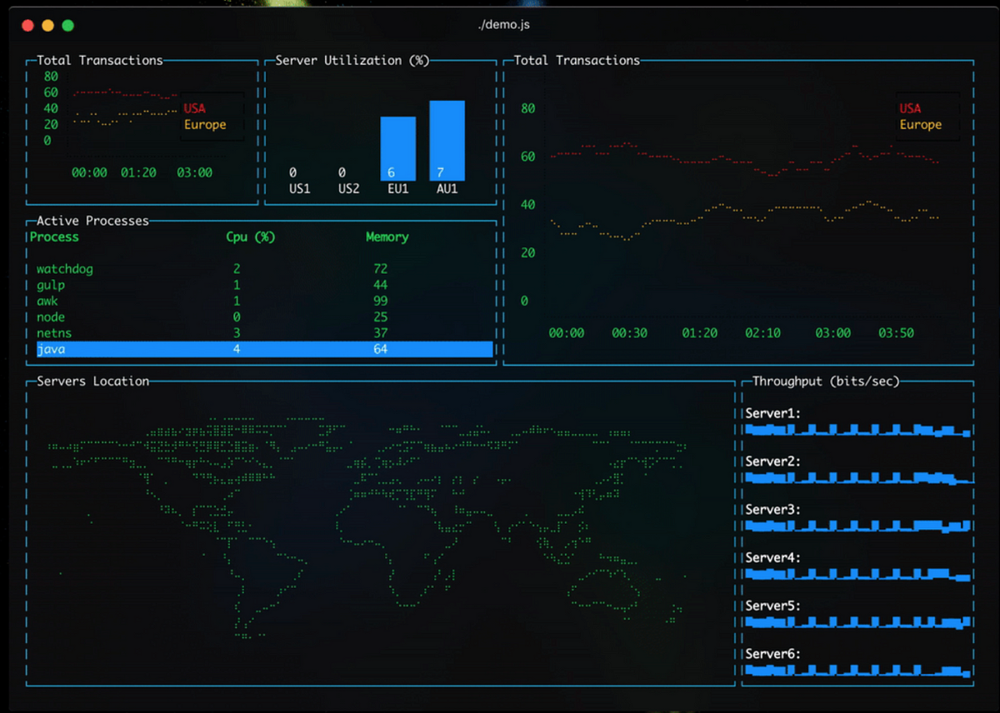
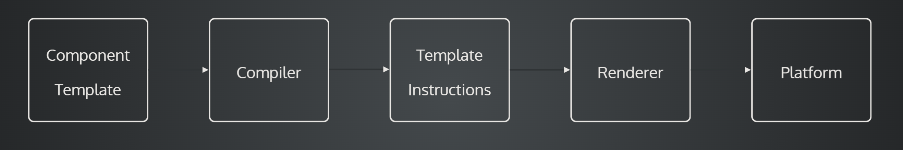
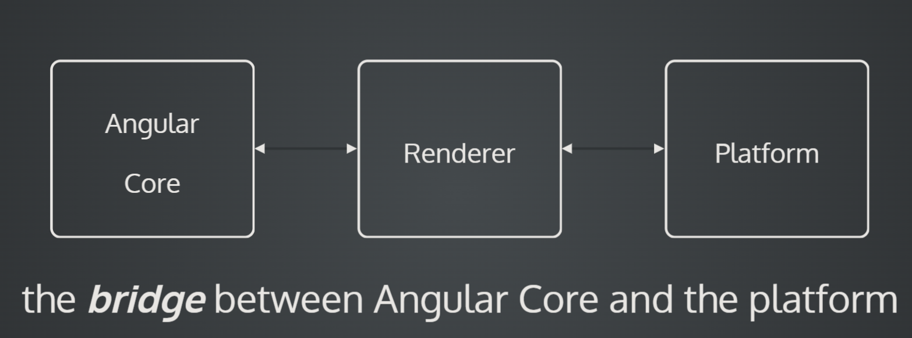

<h1 align="center">Angular platforms</h1>



<span style="background-color: coral;font-weight:bold;color:#2d2d2d; padding: 5px; border-radius: 3px; display:inline-block; margin: 5px 0 0 5px;">#appBootstrap </span>
<span style="background-color: coral;font-weight:bold;color:#2d2d2d; padding: 5px; border-radius: 3px; display:inline-block; margin: 5px 0 0 5px;">#lView</span>
<span style="background-color: coral;font-weight:bold;color:#2d2d2d; padding: 5px; border-radius: 3px; display:inline-block; margin: 15px 0 0 5px;">#renderer3</span>
<span style="background-color: coral;font-weight:bold;color:#2d2d2d; padding: 5px; border-radius: 3px; display:inline-block; margin: 5px 0 0 5px;">#CompilerFactory</span>
<span style="background-color: coral;font-weight:bold;color:#2d2d2d; padding: 5px; border-radius: 3px; display:inline-block; margin: 5px 0 0 5px;">#platformNativeScriptDynamic</span>
<span style="background-color: coral;font-weight:bold;color:#2d2d2d; padding: 5px; border-radius: 3px; display:inline-block; margin: 5px 0 0 5px;">#platformRef</span>
<span style="background-color: coral;font-weight:bold;color:#2d2d2d; padding: 5px; border-radius: 3px; display:inline-block; margin: 5px 0 0 5px;">#ɵDomRendererFactory2</span>
<span style="background-color: coral;font-weight:bold;color:#2d2d2d; padding: 5px; border-radius: 3px; display:inline-block; margin: 5px 0 0 5px;">#ivy</span>
<span style="background-color: coral;font-weight:bold;color:#2d2d2d; padding: 5px; border-radius: 3px; display:inline-block; margin: 5px 0 0 5px;">#platformTerminalDynamic</span>
<span style="background-color: coral;font-weight:bold;color:#2d2d2d; padding: 5px; border-radius: 3px; display:inline-block; margin: 5px 0 0 5px;">#angularCore</span>
<span style="background-color: coral;font-weight:bold;color:#2d2d2d; padding: 5px; border-radius: 3px; display:inline-block; margin: 5px 0 0 5px;">#ɵɵlistener</span>
<span style="background-color: coral;font-weight:bold;color:#2d2d2d; padding: 5px; border-radius: 3px; display:inline-block; margin: 5px 0 0 5px;">#templateInstructions</span>

---

# Application bootstrap

### Introduction

Bootstrapping in Angular is the initialization process that sets up the application environment and enables Angular to start the change detection process, update the view when changes occur, and provide the rich, interactive user experience that Angular is known for.

### Aplication bootstrap process deep dive

1. **Platform Initialization**

   The Platform API in Angular is a module set that provides basic services for the browser and other environments. For creating Angular applications that can run in a browser environment, the `platformBrowserDynamic` includes the `BrowserModule` and the `CommonModule`.

   We can see that plaform is the one that boostraps our Angular aplication (AppModule):

   ```typescript
   import { platformBrowserDynamic } from "@angular/platform-browser-dynamic";
   platformBrowserDynamic().bootstrapModule(AppModule);
   ```

   `platformBrowserDynamic` is a platform factory - a function that creates new instances of platforms. The result of the `platformBrowserDynamic` function call is a `PlatformRef`. `PlatformRef` is a plain Angular service that provides APIs for bootstrapping Angular applications in the browser.

2. **Module Bootstrapping**

   Angular then bootstraps the root module, which is typically your `AppModule`. During this process, the first step is module compilation.

   When `bootstrapModule(AppModule, options)` gets called on `PlatformRef` it compiles the `AppModule`.

   ```typescript
   bootstrapModule<M>(moduleType: Type<M>, options: CompilerOptions): Promise<NgModuleRef<M>> {

   return compileNgModuleFactory(this.injector, options, moduleType)
     .then((moduleFactory: NgModuleFactory) => {

       // ...
     });
   }
   ```

   [Source: angular/packages/core/src/platform/platform_ref.ts](https://github.com/angular/angular/blob/a5a9b408e2eb64dcf1d3ca16da4897649dd2fc34/packages/core/src/platform/platform_ref.ts#L132)

   Angular retrieves an instance of `CompilerFactory` from the injector. `CompilerFactory` is an abstract class that is responsible for creating a `Compiler` instance.

   ```typescript
   function compileNgModuleFactory<M>(...) Promise<NgModuleFactory<M>> {
     //...
     const compilerFactory: CompilerFactory = injector.get(CompilerFactory);
     //...
   }
   ```

   [Source: angular/packages/core/src/platform/platform_ref.ts](https://github.com/angular/angular/blob/a5a9b408e2eb64dcf1d3ca16da4897649dd2fc34/packages/core/src/platform/platform_ref.ts#L137)

   Then, the compiler is asked to compile our AppModule. During the compilation it scans the metadata of all registered components. Subsequently, the compiler generates the template instructions of for all the components inside the `AppModule`.

   ```typescript
   private _moduleDoBootstrap(moduleRef: InternalNgModuleRef<any>): void {
     const appRef = moduleRef.injector.get(ApplicationRef);
     if (moduleRef._bootstrapComponents.length > 0) {
       moduleRef._bootstrapComponents.forEach(f => appRef.bootstrap(f));
     } else if (moduleRef.instance.ngDoBootstrap) {
       moduleRef.instance.ngDoBootstrap(appRef);
     } else {
       throw new RuntimeError(
           RuntimeErrorCode.BOOTSTRAP_COMPONENTS_NOT_FOUND,
           ngDevMode &&
               `The module ${stringify(moduleRef.instance.constructor)} was bootstrapped, ` +
                   `but it does not declare "@NgModule.bootstrap" components nor a "ngDoBootstrap" method. ` +
                   `Please define one of these.`);
     }
     this._modules.push(moduleRef);
   }
   ```

   [Source: angular/packages/core/src/platform/platform_ref.ts](https://github.com/angular/angular/blob/a5a9b408e2eb64dcf1d3ca16da4897649dd2fc34/packages/core/src/platform/platform_ref.ts#L144)

   The final step involves compiling the root application module.
   When that is completed, `PlatformRef` receives the `moduleFactory` which it uses to bootstrap the application.

   ```
   Side note:
   The JIT and AOT compilers both generate an AppModuleNgFactory class from the same AppModule source code. The JIT compiler creates that factory class on the fly, in memory, in the browser. The AOT compiler outputs the factory to a physical file that is imported in the static version of main.ts.
   ```

3. **Change Detection**

   Before actually bootstrapping the Angular application, `PlatformRef` needs to create a root `NgZone`.

   ```typescript
   bootstrapModuleFactory<M>(moduleFactory: NgModuleFactory<M>, options?: BootstrapOptions):
      Promise<NgModuleRef<M>> {
    // Note: We need to create the NgZone _before_ we instantiate the module,
    // as instantiating the module creates some providers eagerly.
    // So we create a mini parent injector that just contains the new NgZone and
    // pass that as parent to the NgModuleFactory.
    const ngZone = getNgZone(options?.ngZone, getNgZoneOptions({
                               eventCoalescing: options?.ngZoneEventCoalescing,
                               runCoalescing: options?.ngZoneRunCoalescing
                             }));
    // Note: Create ngZoneInjector within ngZone.run so that all of the instantiated services are
    // created within the Angular zone
    // Do not try to replace ngZone.run with ApplicationRef#run because ApplicationRef would then be
    // created outside of the Angular zone.
    return ngZone.run(() => {
      const moduleRef = createNgModuleRefWithProviders(
          moduleFactory.moduleType, this.injector,
          internalProvideZoneChangeDetection(() => ngZone));
      //...
   ```

   [Source: angular/packages/core/src/platform/platform_ref.ts](https://github.com/angular/angular/blob/a5a9b408e2eb64dcf1d3ca16da4897649dd2fc34/packages/core/src/platform/platform_ref.ts#L73)

   `NgZone` has to be instantiated before the creation of AppModule, because we need to wrap all the application logic inside the zone.

4. **Rendering**

   Once the components have been initialized and change detection is in place, Angular renders the application to the screen. The component's template is processed, and the resulting HTML is inserted into the designated host element `<app-root>`.

It is important to note that Angular supports other platforms besides `platformBrowserDynamic` such as:

- Mobile using `platformNativeScriptDynamic` with [NativeScript](https://nativescript.org/).
- Server Side Rendering using `platformServer` with [AngularUniversal](https://blog.angular-university.io/angular-universal/).
- Linux terminal using `platformTerminalDynamic` with [Platform-terminal](https://medium.com/angular-in-depth/angular-platforms-in-depth-part-3-rendering-angular-applications-in-terminal-117e4da9c0cc) etc.

# Rendering

## How can Angular become platform-agnostic?

The Angular framework is comprised of two main components:

- **Angular Core**, the heart of any Angular application. It provides fundamental services, including dependency injection, lifecycle hooks, data binding, and more. The Angular Core library is responsible for bootstrapping and launching the application.
- **Renderer** is an engine that convert HTML templates into views. The rendering process involves parsing the template, checking for errors, and producing a view object. The `Renderer` interface is used to manipulate the UI programmatically.

This separation of concerns is what allows Angular to become platform agostic, as Angular core doesn't directly use any web APIs, delegating all of the actual view / HTML creation to the `Render`.

## What is the Renderer?

The `Renderer` is an `Injectable` provided by the platform at application boostrap.

`Renderer` provides an API for UI manipulations. It acts as an abstraction layer over direct DOM manipulations, allowing developers to write code that can be executed in environments that may not have access to the DOM, such as on the server, in a web worker, or in a native mobile or desktop environment.

Since Angular 9 `Renderer` was updated to reduce the risk of XSS attacks because it does not use the `innerHTML` property, which is known to be a potential security vulnerability. Instead, it uses safer alternatives like `textContent` or `setAttribute`.

## Renderer deep dive

To understand better what the Angular `Renderer` does behind the scenes lets take a look at what methods it implements:

```typescript
export interface Renderer {
  destroy(): void;
  createComment(value: string): RComment;
  createElement(name: string, namespace?: string | null): RElement;
  createText(value: string): RText;
  destroyNode?: ((node: RNode) => void) | null;
  appendChild(parent: RElement, newChild: RNode): void;

  insertBefore(
    parent: RNode,
    newChild: RNode,
    refChild: RNode | null,
    isMove?: boolean
  ): void;

  removeChild(parent: RElement, oldChild: RNode, isHostElement?: boolean): void;

  selectRootElement(
    selectorOrNode: string | any,
    preserveContent?: boolean
  ): RElement;

  parentNode(node: RNode): RElement | null;
  nextSibling(node: RNode): RNode | null;

  setAttribute(
    el: RElement,
    name: string,
    value: string | TrustedHTML | TrustedScript | TrustedScriptURL,
    namespace?: string | null
  ): void;

  removeAttribute(el: RElement, name: string, namespace?: string | null): void;

  addClass(el: RElement, name: string): void;
  removeClass(el: RElement, name: string): void;

  setStyle(
    el: RElement,
    style: string,
    value: any,
    flags?: RendererStyleFlags2
  ): void;

  removeStyle(el: RElement, style: string, flags?: RendererStyleFlags2): void;

  setProperty(el: RElement, name: string, value: any): void;
  setValue(node: RText | RComment, value: string): void;

  listen(
    target: GlobalTargetName | RNode,
    eventName: string,
    callback: (event: any) => boolean | void
  ): () => void;
}
```

[Source: angular/packages/core/src/render3/interfaces/renderer.ts](https://github.com/angular/angular/blob/a5a9b408e2eb64dcf1d3ca16da4897649dd2fc34/packages/core/src/render3/interfaces/renderer.ts#L33)

Everything Angular does regarding rendering a component (creating elements, setting attributes, subscribing to events, etc.) goes through the `Renderer` service.

At application bootstrap, the `ɵDomRendererFactory2` internal factory is used to create the default DOM `Renderer` that then gets provided in the environment injector (platform).
Angular uses this factory because different view encapsulations require different renderers. For example `view.encapsulation.shadow` uses the `ShadowDomRenderer`.

```typescript
@Injectable()
export class DomRendererFactory2 implements RendererFactory2, OnDestroy {
  //...
  private getOrCreateRenderer(element: any, type: RendererType2): Renderer2 {
    //...
    switch (type.encapsulation) {
      case ViewEncapsulation.Emulated:
        renderer = new EmulatedEncapsulationDomRenderer2(...);
        break;
      case ViewEncapsulation.ShadowDom:
        return new ShadowDomRenderer(...);
      default:
        renderer = new NoneEncapsulationDomRenderer(...);
        break;
    }
  }
  //...
}
```

[Source: angular/packages/platform-browser/src/dom/dom_renderer.ts](https://github.com/angular/angular/blob/a5a9b408e2eb64dcf1d3ca16da4897649dd2fc34/packages/platform-browser/src/dom/dom_renderer.ts#L63)

The `Renderer` can also be provided in several places:

- inside the `providers` array at bootstrap (default).
- inside the `router providers`, this enables us to use different renderers on different routes.
- using the `viewContainerRef`. At component creation, the component gets its own environment injector. We can use it to provide the `Renderer` just for that component's sub-tree.

During the creation of the view, Angular uses the `Renderer` service to create and configure elements according to the view definition.
<br>

For example, if the view definition specifies that a `<div>` element should be created, Angular uses the `createElement` method of `Renderer` to create it. Similarly, if the view definition specifies that a certain element should be added to the DOM, Angular uses the `appendChild` method of `Renderer` to add this element.
<br>

```ts
class DefaultDomRenderer2 implements Renderer2 {
  createElement(name: string, namespace?: string): any {
    constructor(private readonly doc: Document){}
    if (namespace) {
      return this.doc.createElementNS(NAMESPACE_URIS[namespace] || namespace, name);
    }
    return this.doc.createElement(name);
  }
}
```

[Source: angular/packages/platform-browser/src/dom/dom_renderer.ts](https://github.com/angular/angular/blob/a5a9b408e2eb64dcf1d3ca16da4897649dd2fc34/packages/platform-browser/src/dom/dom_renderer.ts#L146)

After the initial rendering of the view, Angular uses the `Renderer` service to update the view when the data bound to the view changes. When a data-bound property changes, Angular uses `Renderer` to update the corresponding element in the DOM.
<br>

Finally, when a view is destroyed, Angular uses the `Renderer` service to clean up any resources associated with the view. This includes removing the view's root element from the DOM and cleaning up any event listeners attached to the view's elements.

## How Angular parses templates and renders components

At the beginning of the compilation stage, the component gets transformed into template instructions. These generated template instructions call specific methods of the `Renderer`. The `Renderer` then interacts with the platform.



The `Renderer` is the bridge between your template and the platform that you are working with. It represents the platform and decuples Angular core from any direct UI manipulation.



Our simple example app-component:

```ts
@Component({
  template: `
    <div>This is inside the div</div>
    <app-parent />
  `,
  imports: [ParentComponent],
})
export class AppComponent {
  title = "ng-renderer";
}
```

Will generate the following template instructions after compilation:

```js
class AppComponent {
  constructor() {
    this.title = 'ng-renderer';
  }
}
AppComponent.ɵfac = function AppComponent_Factory(t) {
  return new (t || AppComponent)();
};
AppComponent.ɵcmp = /*@__PURE__*/_angular_core__WEBPACK_IMPORTED_MODULE_1__["ɵɵdefineComponent"]({
  type: AppComponent,
  selectors: [["app-root"]],
  standalone: true,
  features: [_angular_core__WEBPACK_IMPORTED_MODULE_1__["ɵɵStandaloneFeature"]],
  decls: 3,
  vars: 0,
  template: function AppComponent_Template(rf, ctx) {
    if (rf & 1) {
      _angular_core__WEBPACK_IMPORTED_MODULE_1__["ɵɵelementStart"](0, "div");
      _angular_core__WEBPACK_IMPORTED_MODULE_1__["ɵɵtext"](1, "This is inside the div");
      _angular_core__WEBPACK_IMPORTED_MODULE_1__["ɵɵelementEnd"]();
      _angular_core__WEBPACK_IMPORTED_MODULE_1__["ɵɵelement"](2, "app-parent");
    }
  },
  dependencies: [_parent_component__WEBPACK_IMPORTED_MODULE_0__.Parent],
  encapsulation: 2
});`
```

For now, we will focus on the `template` function. As we can see it receives two parameters:

- `ctx` represents the context object for the component. It holds the data and methods that are available for use in the template and provides a way for the template to interact with the component's properties and methods. Since a component can have multiple rendered instances this context allows Angular to bind event listeners and properties to the proper instance.
- `rf` (render flags) is a bitmask that helps Angular optimize rendering during change detection. It determines if the component is in the creation or the update phase. The creation phase is where all the component's context and dependency injection is resolved.
  The update phase happens when change detection runs on the component.

`ɵɵelementStart` is part of Angular's `Renderer` and is used to create an HTML element in the component's view.

```js
_angular_core__WEBPACK_IMPORTED_MODULE_1__["ɵɵelementStart"](0, "div");
```

When we as a developer write a `div` in an Angular `.HTML` template file, we intuitively know that we refer to the `div` element of the HTML DOM.
But if we look into the template function, there is nothing that tells Angular that `div` is an HTML `div` element. To Angular core (the template fct) our `div` is just a generic element with the tag name `div`.

Let's take a closer look at the `ɵɵelementStart` method:

```js
function ɵɵelementStart(index, name, attrsIndex, localRefsIndex) {
  /* ... */
  const renderer = lView[RENDERER];
  const native = (lView[adjustedIndex] = createElementNode(
    renderer,
    name,
    getNamespace$1()
  ));
  /* ... */
  return ɵɵelementStart;
}

/* ... */

function createElementNode(renderer, name, namespace) {
  ngDevMode && ngDevMode.rendererCreateElement++;
  // looks familiar?
  return renderer.createElement(name, namespace);
}
```

[Source:angular/packages/core/src/render3
/node_manipulation.ts](https://github.com/angular/angular/blob/a5a9b408e2eb64dcf1d3ca16da4897649dd2fc34/packages/core/src/render3/node_manipulation.ts#L123)

In our case `ɵɵelementStart` gets called with an `index` of _0_ and `name` is _div_ since the first element of our app-component template is a `div`.

```js
const renderer = lView[RENDERER];
```

This is the line where `Renderer` is provided by the platform injector.

```js
return renderer.createElement(name, namespace);
```

This is the first place where Angular knows that _div_ refers to the an actual HTML `div` element.

### Event and property binding

```HTML
<div [id]="title" title="my-title" (click)="onClick()">
  This is inside the div
</div>
```

If we add the `onClick` event listener, an _id_ 'input' and a _title_ property binding to our div in the app component the recompiled template instructions will look like this:

```typescript
AppComponent.ɵcmp = /*@__PURE__*/ _angular_core__WEBPACK_IMPORTED_MODULE_1__[
  "ɵɵdefineComponent"
]({
  /* ... */
  consts: [["title", "my-title", 3, "id"]],
  template: function AppComponent_Template(rf, ctx) {
    if (rf & 1) {
      /* ... */
      _angular_core__WEBPACK_IMPORTED_MODULE_1__["ɵɵelementStart"](0, "div", 0);
      _angular_core__WEBPACK_IMPORTED_MODULE_1__["ɵɵlistener"](
        "click",
        function AppComponent_Template_div_click_0_listener() {
          return ctx.onClick();
        }
      );
      /* ... */
    }
    if (rf & 2) {
      _angular_core__WEBPACK_IMPORTED_MODULE_1__["ɵɵproperty"]("id", ctx.title);
    }
  },
  /* ... */
});
```

We can see that we have a couple of new functions. Firstly the bindings get added to the `const` array. Secondly a new function `ɵɵlistener` is generated for the `onClick` event listener.

```js
_angular_core__WEBPACK_IMPORTED_MODULE_1__["ɵɵproperty"]("id", ctx.title);
```

The `ɵɵproperty` is binding the `id` input using `ctx` (the component instance), we can also see that it runs in the update phase of the component (rf & 2), this makes sense since inputs in an Angular component get resolved in `ngOnInit()` not in the `constructor()`.

```javascript
function ɵɵlistener(eventName, listenerFn, useCapture, eventTargetResolver) {
  const lView = getLView();
  const tView = getTView();
  const tNode = getCurrentTNode();
  listenerInternal(...);
  return ɵɵlistener;
}
```

If we take a close look at the `ɵɵlistener` method we can see that it also delegates the event listener to the `Renderer` by calling `listenerInternal()` which in turn calls `renderer.listen()`.

```js
function listenerInternal(tView, lView, renderer, tNode, eventName, listenerFn, eventTargetResolver) {
    //...
    if (existingListener !== null) {
        //...
    } else {
    listenerFn = wrapListener(...);
    const cleanupFn = renderer.listen(target, eventName, listenerFn); // <- call to renderer
    ngDevMode && ngDevMode.rendererAddEventListener++;
    lCleanup.push(listenerFn, cleanupFn);
    tCleanup &&
        tCleanup.push(
        eventName,
        idxOrTargetGetter,
        lCleanupIndex,
        lCleanupIndex + 1
        );
    }
}
```

Understanding the `Renderer` can empower us to implement a custom one, that will allow Angular to run on a niche platform. This is a very powerful feature of Angular as it gives us the ability to leverage all the tools provided by the framework such as dependency injection, services, observables, data binding, etc.

### Further Readings

- [Creating a custom webGL Renderer]('https://www.youtube.com/watch?v=fVBWeAMqaDQ')
- [Rendering an Angular app in a Linux terminal](https://medium.com/angular-in-depth/angular-platforms-in-depth-part-3-rendering-angular-applications-in-terminal-117e4da9c0cc)
- [Angular platforms in depth 1](https://medium.com/angular-in-depth/angular-platforms-in-depth-part-1-what-are-angular-platforms-9919d45f3054)
- [Angular platforms in depth 2](https://medium.com/angular-in-depth/angular-platforms-in-depth-part-2-application-bootstrap-process-8be461b4667e)
